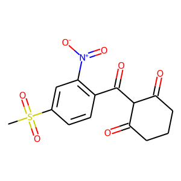

# Mesotrione

## Contents
- **Herbicide Classes**
- **The Herbicide Discovery Problem**
- **4-Hydroxyphenyl-Pyruvate Dioxygenase (HPPD) Inhibition and Mechanism of Action**
- **HPPD Inhibitor Development and Classes**
- **HPPD Tolerance in Crops**
- **HPPD Tolerance in Weeds**
- **HPPD Tolerance in Weeds**
- **Engineered HPPD-Resistance Crops**
---------

{align=center}

## Herbicide Classes
## The Herbicide Discovery Problem
## 4-Hydroxyphenyl-Pyruvate Dioxygenase (HPPD) Inhibition and Mechanism of Action
## HPPD Inhibitor Development and Classes
## HPPD Tolerance in Crops
## HPPD Tolerance in Weeds
## HPPD Tolerance in Weeds
## Engineered HPPD-Resistance Crops
