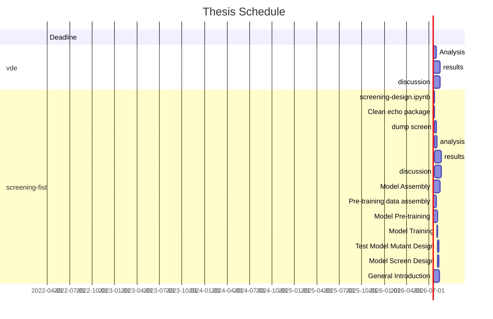

# Thesis

WIP

## Recently Changed

- [update vde methods section](methods-evo.md) - 2022-02-01 - added commit hashes and some detains for experiment $A$ and $B$. Removed Lab sections.
- [run and cleanup of vde](https://github.com/jamesengleback/vde) - 2022-01-30
- [cleanup of thesis repo](https://github.com/jamesengleback/thesis) - 2022-01-30
- [vde analysis notebook](evo-a-b.md) - 2022-01-25
- [this page](index.md) - updated gantt chart 2022-01-31
- [vde methods](methods-evo.md) - vde runtime 2022-01-20

!!! info
	**vde:** no longer plan to make and test mutants in the lab - instead analyse technique

## vde
- [x] vde - [**Exp a & b**](https://github.com/jamesengleback/vde)
- [ ] vde - [**methods**](methods-evo.md) 
- [ ] vde - [**analysis**](evo-a-b.md) 
- [ ] vde - [**results**](results-evo.md)
- [ ] vde - [**discussion**](discussion-evo.md)

## screening-fist
- [ ] screening-fist - `design.ipynb`  
- [ ] screening-fist - dump screen
- [ ] screening-fist - model pretraining data
- [ ] screening-fist - model
- [ ] screening-fist - train
- [ ] screening-fist - [**methods**](methods-rio.md)
- [ ] screening-fist - [**analysis**](analysis-rio.md)
- [ ] screening-fist - [**results**](results-rio.md)
- [ ] screening-fist - [**discussion**](discussion-rio.md)

## Contributiing
[**Project Github Page**](https://github.com/jamesengleback/thesis)

!!! info "help"
	see [contributing](contributing.md) for info on suggesting edits etc via github

