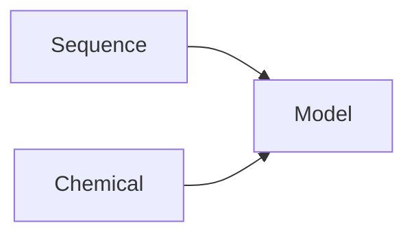

# Introduction

## Contents

---------

## Background
### Overview
- Engineering Context: Herbicide Resistance
- Target herbicide: mesotrione
- Template Enzyme: P450 BM3
- Approach: Screening and deep learning-based design

### [Deep Learning](deep-learning.md)
### [High Throughput Screening](hts.md)
### [Mesotrione](mesotrione.md)
## Aim
## Approach
### [Screening Program](screening-fist.md)
