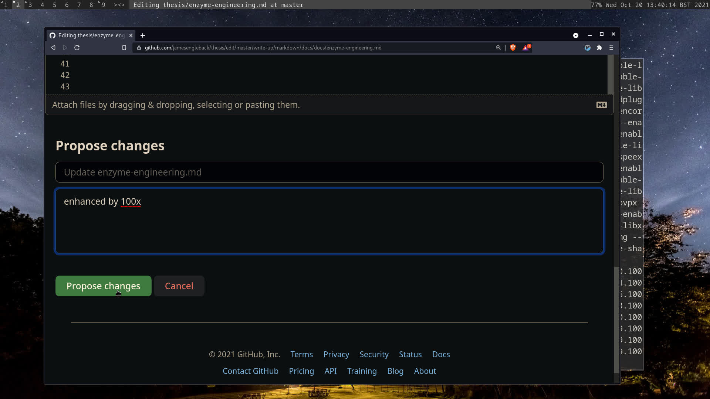
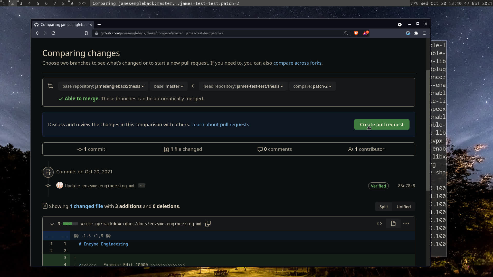

# Contributing :fontawesome-brands-github:

## Contents

---------

## Overview
This document outlines how to contribute comments and suggested changes to this thesis.
The thesis is hosted at [**jamesengleback.xyz**](jamesengleback.xyz) and the working repository is at [**https://github.com/jamesengleback/thesis**](https://github.com/jamesengleback/thesis).
For my convenience it's being written in [markdown](https://en.wikipedia.org/wiki/Markdown) - an easy to write, interconvertible text format.
My markdown is converted to [html](https://en.wikipedia.org/wiki/HTML) for your browser by [mkdocs](https://www.mkdocs.org/).

Here are some good markdown cheatsheets:

- [https://www.gov.uk/guidance/how-to-publish-on-gov-uk/markdown](https://www.gov.uk/guidance/how-to-publish-on-gov-uk/markdown)
- [https://www.markdownguide.org/](https://www.markdownguide.org/)
- [https://guides.github.com/features/mastering-markdown/](https://guides.github.com/features/mastering-markdown/)

I'm managing versions of this project with [git](https://en.wikipedia.org/wiki/Git) because it lets me track suggested merges etc from multiple sources.
The complication is that anyone who wants to help will need to know how to do it.

Here is a quick guide on how to contribute changes, suggestions etc:

## Git & Pull Requests

For most, the convenient way to suggest changes to the thesis is via the browser. Here's an example of suggesting a change to one of the markdown files from a test account.

### Login/Sign Up at [github.com](https://github.com/)

### Find My Thesis Repository at [https://github.com/jamesengleback/thesis](https://github.com/jamesengleback/thesis)

### Find the File You Want to Amend, Comment Etc.
The Markdown files I'm working in are currently down the file system at [`thesis/write-up/markdown/docs/`](https://github.com/jamesengleback/thesis/tree/master/write-up/markdown/docs). 

### Open The Editor (pencil icon)

### Edit!

### Click `Propose Changes` at the foot of the Editor Page (hint: it's all green buttons from here)
Comments here are useful!

### Confirm with `Create Pull Request`

### Confirm Again with `Create Pull Request`

### Done!
### Track the pull request and talk about it. You'll be notified

## Bug Reports
