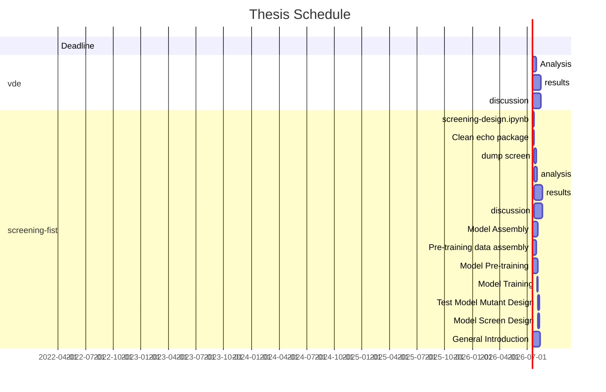

# Thesis

WIP

## Recently Changed

- [vde analysis notebook](evo-a-b.md) 
- [this page](index.md) - updated gantt chart 2022-01-31
- [vde methods](methods-evo.md) - vde runtime 2022-01-20

!!! info
	**vde:** no longer plan to make and test mutants in the lab - instead analyse technique

### vde
- [x] vde - **Exp a & b**
- [ ] vde - **analysis** :hourglass:
- [ ] vde - **results**
- [ ] vde - **discussion**

### screening-fist
- [ ] screening-fist - `design.ipynb`  :hourglass:
- [ ] screening-fist - dump screen
- [ ] screening-fist - model pretraining data
- [ ] screening-fist - model
- [ ] screening-fist - train
- [ ] screening-fist - **analysis**
- [ ] screening-fist - **results**
- [ ] screening-fist - **discussion**

[:fontawesome-brands-github: **Project Github Page**](https://github.com/jamesengleback/thesis)

!!! info "help"
	:fontawesome-solid-edit: see [contributing](contributing.md) for info on suggesting edits etc via github

