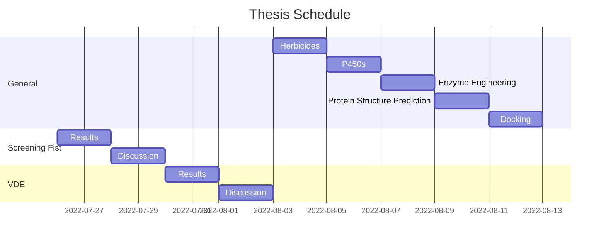

# Thesis

- General:
    - [Overview](general-overview.md)
    - [AI](general-ai.md)
    - [Directed Evolution](general-directed-evolution.md)
    - [Docking](general-docking.md)
    - [HPPD Herbicides](general-hppds.md)
    - [Cytochrome P450s](general-p450s.md)
    - [Protein Structure Prediction](general-protein-structure-prediction.md)
- Screening Fist:
    - [Introduction](sxfst-introduction.md)
    - [Methods](sxfst-methods.md)
    - [Results](sxfst-results.md)
    - [Discussion](sxfst-discussion.md)
- Virtual Directed Evolution:
    - [Introduction](vde-introduction.md)
    - [Methods](vde-methods.md)
    - [Results](vde-results.md)
    - [Discussion](vde-discussion.md)

---

## todo

- [ ] **General :**
	- [ ] **HPPD Herbicides :**
		- [ ] **Scaffold :**
		- [ ] **Dock to ntHPPD :**
		- [ ] **Dock to Cyp72A1 :**
	- [ ] **P450s :**
	- [ ] **Enzyme Engineering :**
	- [ ] **Protein Structure Prediction :**
	- [ ] **Docking :**
- [ ] **Screening Fist:**
	- [ ] **Results:**
		- [ ] **Screening Data:** Describe
		- [ ] **Model Training:** Describe
		- [ ] **Generated Proteins:** Do, Describe
	- [ ] **Discussion:**
		- [ ] **Issues:**
		- [ ] **Improvements:**
- [ ] **VDE:**
	- [ ] **Results:**
	- [ ] **Discussion:**
		- [ ] **Issues:**
		- [ ] **Improvements:**

---

\bib
