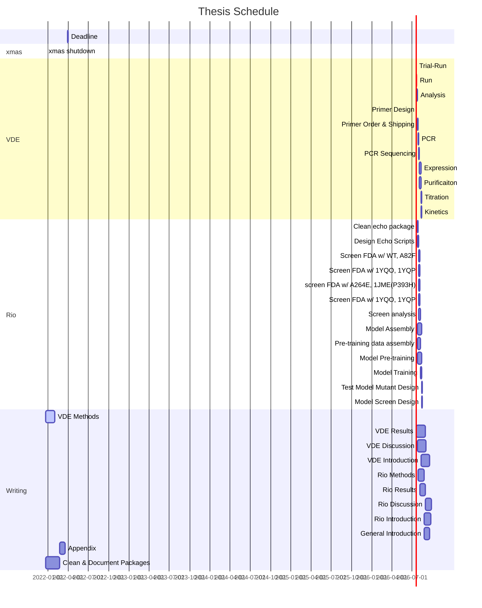

# My Thesis

WIP

### Recently Changed

- [this page](index.md) - updated gantt chart 2022-01-20
- [vde methods](methods-evo.md) - vde runtime 2022-01-20

[:fontawesome-brands-github: **Project Github Page**](https://github.com/jamesengleback/thesis)

!!! info "help"
	:fontawesome-solid-edit: see [contributing](contributing.md) for info on suggesting edits etc via github

## Overveiw 
I'm structuring this thesis as two independent papers, though some background and methods overlap so these will be shared.
The appendix details the software developed for this work.

### Overlap 
> Files relevant to both papers

- **Motivation** The end goal for both projects is to re-engineer the Cytochrome P450 BM3 to bind to and turnover the herbicide mesotrione. The background information for the engineering context is in 
	- [**Herbicide-Resistance**](herbicide-resistance.md) - background on herbicide resistant crops, their value in food supply chains and approaches to their engineering
	- [**Enzyme Engineering**](intro-enzyme-engineering.md) -  background on approaches to enzyme engineering, including directed evolution, *in-silico* design and machine learning-guided design.
	- [**Cytochrome P450s**](p450s.md) - background on the class of enzyme being re-engineered here. Overveiws evolutionary history and phylogenetics, biological function, structure, biochemical mechanism of action, experimental techniques and applications in biotech.
	- [**BM3**](bm3.md) - background on phylogenetics, mechanism of action, structure, heterologous expression, engineering case studies.
	- [**General Methods**](methods-general.md) - mutageneis, expression and purification

### Paper 1
#### **Working Title**: Virtual Directed Evolution for Cytochrome P450 Engineering
> **Summary:** Simulate directed evoltuion using protein structure prediction, target ligand docking and scoring and a genetic algorithm to generate iteratively better mutants.

- [**Introduction**](intro-evo.md) - motivates engineering context, outlines aim and approach.
	- [**Protein Structure Prediction**](protein-structure-pred.md) - background on template-based design, relevant approaches.
	- [**Docking**](docking.md) - background on ligand docking applications, algorithms and limitations
	- [**Genetic Algorithms**]() - as sequence optimizers
- [**Methods**](methods-evo.md) - vde paramaters & run details, analysis, lab work
- [**Results**](results-evo.md) - docking analysis, evolutionary analysis, lab measured activity
- [**Discussion**](discussion-evo.md) - suitability of products for application, efficacy of technique, proposed improvements

### Paper 2 
#### **Working Title**: Screening Fist - Mapping Cytochrome P450 Substrate Specificity to Sequence with Machine Learning
> **Summary:** Train a machine learning model on P450 BM3 mutant:ligand binding screening data, use model for optimal screening design and to re-design BM3 for herbicide binding.

- [**Introduction**](intro-rio.md) - motivates engineering context, outlines aim and approach.
	- [**Deep Learning**](deep-learning.md) - perceptrons as a base neural unit, deep learning, transformers, evolutionary scale modelling, graph neural networks
	- [**High Throughput Screening**](hts.md) - background on high throughput screening, SBS plate standaerdisation, liquid handling automation, plate readers, applications in biotech, technology readiness level 
- [**Methods**](methods-rio.md) - model architecture, pre-training data, pre-training, lab screening program, training, planning subsequent screens with adaptive learning.
- [**Results**](results-rio.md) - model pre-training accuracy, screening results and analysis, model training & accuracy, adaptive learning.
- [**Discussion**](discussion-rio.md) - suitability of products for application, efficacy of technique, proposed improvements

### Appendix - Software
- [`enz`](enz.md) - a python wrapper for protein structure prediction, molecular docking and its analysis.
- [`plates`](plates.md) - a python utility for automating plate assay analysis
- [`echo`](echo.md) - a python utility for designing custom instructions for Labcyte Echo liquid handlers
- [`cpd`](cpd.md) - a python utility for selecting diverse sets of screening compounds
- [`mxn`](mxn.md) - a python utility for automated primer design for protein site-directed mutageneis
