# Virtual Directed Evolution Analysis

## Contents
## Overview
- `evo/bm3/main.py` was run with two *fitness* functions, $A$ & $B$ on a `g6-dedicated-50` linode instance each. 
    - The program uses virtual directed evolution to identify mutants of P450 BM3 to  hydroxylate the herbicide mesotrione at $C_5$.
    - The program uses a genetic algorithm to generate pools of BM3 active site mutants that are evaluated for *fitness* by predicting their structure and docking mesotrione into the active site.
    - The *fittest* mutants of each generation are used to repopulate the next by breeding via crossover and point mutation.

*Fitness* functions $A$ and $B$ were tested, which both vary on scoring: 
- The configuration of mesotrione in the predicted active site 
- The number of mutations relative to the starting sequence - *Hamming Distance*.

Results analysis here.

## Experimental Details
For each score, `evo/bm3/main.py` was run in eight instances using `evo/bm3/evo.sh` with the following configuration:

| Paramater | Value |
| --------- | ------|
| Population size | 128 |
| Survival rate | 0.25 |
| Docking Exhaustiveness | 16 |

Each `g6-dedicated-50` was provisioned with `evo/cloud/build-linode.sh` and the configuration scripts in `evo/cloud/config`.
Each experiment lasted about 3 days and cost $103. 
Data generated was structures, docking poses and scores for each mutant - it was compressed into a `.tar.gz` archive and uploaded to a linode bucket and the machines were terminated.

The eight replicates were run in parralell, generating 32,000 mutants for each experiment.

Score functions $A$ and $B$ were functions of the following metrics:
- **Affinity:** Each mutant generated eight mesotrione docking poses, each with a `vina` docking score - an estimate of binding energy $\Delta G$ in *kcac/mol*. $-10 < a < -1$
- **$C_5$ - Heme Iron Distance:** Distance in $\A$ of mesotrione $C_5$  to the heme iron for each pose. $5 < d < 30$
- **Hamming Distance w.r.t. BM3 A82F/F87V:** Number of mutations relative to the template. $0 < h < \text{n mutation sites}$

The progam aimed to minimize $a$ $d$ and $h$.
- Low $a$ and $d$ indicate that mesotrione binds tightly with $C_5$ close to the heme.
- Low $h$ is practical for constructing the best mutants by site-directed mutagenesis. 
- Low $h$ may also limits the chance of mutations with unpredictable, problematic effects.

### Score $A$

Uses the mean $a$ and $d$ between all poses - `dist_mean` & `aff_mean`.

$$ fn_A(a, d, h) = d - \log{|a|} - h $$

```python
def score_a(distances, affinities, hamming_dist):
    return np.mean(distances) - np.log(abs(affinities)) - hamming_dist

```
### Score $B$
Weighted average of $d$ by $softmax(a)$.

$$ fn_B(a, d, h) = (\frac{1}{n} \sum_{n}^{i} softmax(\log{|a|}_i)\times d_i) -  h $$

This weights more heavily the distances in the poses that bind tightly.

```python
# todo : code sample
```

## Data Description
The data analysed here are aggreagates of all repeats in experiements $A$ and $B$. 
Each holds data from 35,000 mutants.

The fields are:
- `gene` - a 25 character string containing letter codes for amino acids at mutation sites, maps to sites `[47, 49, 51, 75, 78, 88, 94, 138, 142, 175, 178, 184, 188, 205, 226, 252, 255, 260, 263, 290, 295, 328, 330, 350, 353]`
- `aff_mean` - mean `vina` affinity score across docking poses for each mutant
- `dist_mean` - mean $C_5$ - heme iron distance in  docking poses for each mutant
- `ham` - *Hamming* distance of mutant w.r.t the template gene - BM3 A82F/F87V

## Results
## Notebook


## Data Wrangling

Extracting the data from buckets:
```sh
$ linode-cli obj get james-engleback evoa-runs.tar.gz evob-runs.tar.gz
...
$ ls
evoa-runs.tar.gz/
evob-runs.tar.gz/
$ tar xfz *
$ ls
runs-a/
runs-b/
```
After extracting and concatenating:
```sh
'experiment-a/all-scores-a.csv'
'experiment-b/all-scores-b.csv'
```

# Initial Look at the Data

- [ ] Columns mislabelled
- [ ] Distributions of metrics
- [ ] Look at pairwise correlations
- [ ] TSNE


```python
import os
import pandas as pd
import matplotlib.pyplot as plt

dfa = pd.read_csv('experiment-a/all-scores-a.csv')
dfb = pd.read_csv('experiment-b/all-scores-b.csv')

print(len(dfa))
print(len(dfb))
```

    32791
    32768


```python
dfa.head()
```


<div>
<style scoped>
    .dataframe tbody tr th:only-of-type {
        vertical-align: middle;
    }

    .dataframe tbody tr th {
        vertical-align: top;
    }

    .dataframe thead th {
        text-align: right;
    }
</style>
<table border="1" class="dataframe">
  <thead>
    <tr style="text-align: right;">
      <th></th>
      <th>gene</th>
      <th>score</th>
      <th>dist_mean</th>
      <th>aff_mean</th>
      <th>ham</th>
      <th>uid</th>
    </tr>
  </thead>
  <tbody>
    <tr>
      <th>0</th>
      <td>RTYLVTKDPTVALFSERTIAAAAGL</td>
      <td>-6.644444</td>
      <td>8.968495</td>
      <td>11.002474</td>
      <td>1</td>
      <td>odpyx</td>
    </tr>
    <tr>
      <th>1</th>
      <td>RTYLVTKHPTVALFSERTIAAAAGA</td>
      <td>-6.377778</td>
      <td>11.459518</td>
      <td>13.457990</td>
      <td>1</td>
      <td>rrpba</td>
    </tr>
    <tr>
      <th>2</th>
      <td>RTYLVTKHPTVALFCERTIAAAAGL</td>
      <td>-6.155556</td>
      <td>12.072315</td>
      <td>14.040204</td>
      <td>1</td>
      <td>ripnd</td>
    </tr>
    <tr>
      <th>3</th>
      <td>RTYLVTKTPTVALFSERTIAAAAGL</td>
      <td>-6.722222</td>
      <td>6.944881</td>
      <td>8.988983</td>
      <td>1</td>
      <td>ltcfx</td>
    </tr>
    <tr>
      <th>4</th>
      <td>RTYLVTKHQTVALFSERTIAAAAGL</td>
      <td>-6.377778</td>
      <td>11.197797</td>
      <td>13.196269</td>
      <td>1</td>
      <td>ftauu</td>
    </tr>
  </tbody>
</table>
</div>


```python
dfb.head()
```


<div>
<style scoped>
    .dataframe tbody tr th:only-of-type {
        vertical-align: middle;
    }

    .dataframe tbody tr th {
        vertical-align: top;
    }

    .dataframe thead th {
        text-align: right;
    }
</style>
<table border="1" class="dataframe">
  <thead>
    <tr style="text-align: right;">
      <th></th>
      <th>gene</th>
      <th>score</th>
      <th>dist_mean</th>
      <th>aff_mean</th>
      <th>ham</th>
      <th>uid</th>
    </tr>
  </thead>
  <tbody>
    <tr>
      <th>0</th>
      <td>YTYLVTKHPTVALFSERTIAAAAGL</td>
      <td>-6.077778</td>
      <td>1.435890</td>
      <td>13.810326</td>
      <td>1</td>
      <td>trndl</td>
    </tr>
    <tr>
      <th>1</th>
      <td>RGYLVTKHPTVALFSERTIAAAAGL</td>
      <td>-6.677778</td>
      <td>1.177079</td>
      <td>11.440144</td>
      <td>1</td>
      <td>xvixg</td>
    </tr>
    <tr>
      <th>2</th>
      <td>RTYLVTKHPTVALFSERLIAAAAGL</td>
      <td>-6.400000</td>
      <td>1.199482</td>
      <td>10.705550</td>
      <td>1</td>
      <td>qwaka</td>
    </tr>
    <tr>
      <th>3</th>
      <td>RTYLVTKHPTVALFSERTIAAANGL</td>
      <td>-5.700000</td>
      <td>1.658918</td>
      <td>15.074071</td>
      <td>1</td>
      <td>nkude</td>
    </tr>
    <tr>
      <th>4</th>
      <td>RTYLVTKHPTVALFSERTIAAAAGQ</td>
      <td>-6.666667</td>
      <td>1.307910</td>
      <td>11.364175</td>
      <td>1</td>
      <td>vxnfy</td>
    </tr>
  </tbody>
</table>
</div>


Column names are in the wrong order.
Should be:
$$
-10 < aff_{mean} < 0
$$
$$
0 < dist_{mean} 
$$
$$
score < dist_{mean}
$$


```python
dfa.columns = ['gene', 'aff_mean','score', 'dist_mean',  'ham', 'uid']
dfb.columns = ['gene', 'aff_mean','score', 'dist_mean',  'ham', 'uid']
```


```python
plt.style.use('dark_background')
fig, ax = plt.subplots(4,2,figsize=(7,10))
cols = ['score', 'dist_mean', 'aff_mean', 'ham']
for col, plot, name in zip([df[i] for i in cols for df in [dfa, dfb]],\
                           ax.flatten(),
                           ['Experiment A', 'Experiment B']*4):
    plot.hist(col, bins=50)
    plot.set_xlabel(col.name)
    plot.set_ylabel('count')
    plot.set_title(name)
plt.tight_layout()
plt.savefig(f'hists-{name}.png')
plt.show()
```


    
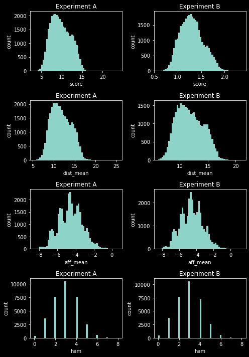
    


## Distributions

### Comparison 
Experiment A and B look similar.

### Hamming Distance
`ham` - Hamming distance of a mutant w.r.t the template gene.
It tends towards 3 in both runs, which is good in terms of constructing mutants via site-directed mutagenesis.

`ham` was constrained via the score function.

### Affinity
`aff_mean` - the mean affinity score calculated by `vina` across all poses for the mutant.
Looks fairly normally distributed with a mean of around -4.

### Heme-C<sub>5</sub> Distance
### Score

## Distributions & Pairwise Correlations

## Experiment A
- `score` correlates 1:1 with `dist_mean` - reflects the score function used
- `ham` correlates very well with `aff_mean` - as `ham` increases `aff_mean` increases (gets worse)
- `aff_mean` seems to have clusters - probably corresponds to popular docking poses


```python
import seaborn as sns

sns.pairplot(dfa, kind='kde')
plt.savefig('pairplot-dfa.png')
plt.show()
```


    
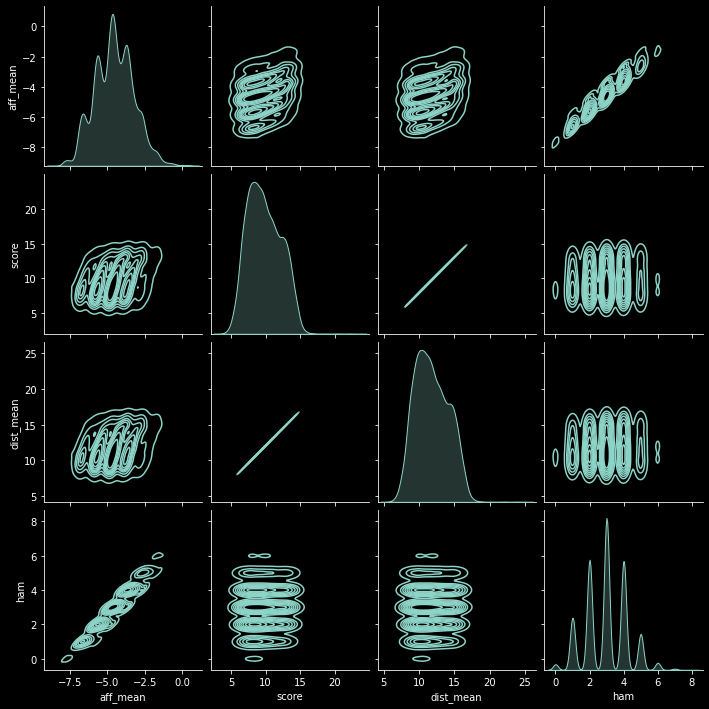
    


## Experiment B
Similar story here.
- `score` doesn't have as tight a correlation with `dist_mean` - but still pretty tight


```python
sns.pairplot(dfb, kind='kde')
plt.savefig('pairplot-dfb.png')
plt.show()
```


    
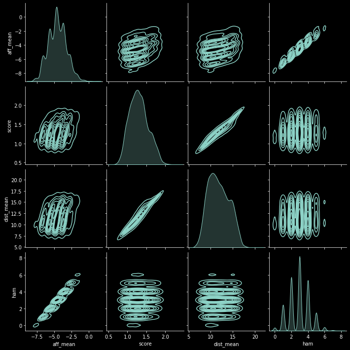
    


## Duplicates
76% of the sequences are unique.


```python
df_ = pd.concat([dfa, dfb])
print(len(dfa.gene.unique()) / len(dfa))
print(len(dfa.gene.unique()) / len(dfa))
print(len(df_.gene.unique()) / len(df_))
```

    0.7788417553597023
    0.7788417553597023
    0.763876813252185


```python
duplicates = df_.loc[df_.gene.duplicated(),:]
print(len(duplicates))
print(len(duplicates.gene.unique()))
```

    15480
    5991


```python
val_counts = duplicates.gene.value_counts()
val_counts
```


    RTYLVTKHPTVALFSERTIAAAAGL    826
    RTYLVTKRPTVALFSERTIAAAAGL     43
    RTYLVFKHPTVALFSERTIAAAAGL     41
    RTYLVTKHPTVASFSERTIAAAAGL     39
    RTYLVTKHPTVANFSERTIAAAAGL     37
                                ... 
    RTYLVTKHPLVALFSERSIAGAAGL      1
    RPYLVTKHPTVALFEERTIAQAAGL      1
    RTNLVTTHPTVALFSERTIAAAAGL      1
    RTYLVNKHPTVALFIERTIAAAAGI      1
    RTYLVTKHPTVALFFERTHAAAAGL      1
    Name: gene, Length: 5991, dtype: int64


The most popular gene at 826 is the template.
The number of initial templates is 16, so the template is revisted a lot.
Probably because of the `ham` constraint.


```python
template_gene = val_counts.index[val_counts.argmax()]
set(df_.loc[df_.gene == template_gene, 'ham'])
```


    {0}


## Template duplicates
There are 826 duplicates of the template gene across both experiments.
Scores not plotted for the aggregation of both experiments.


```python
template = df_.loc[df_.gene == template_gene, :]
fig, ax = plt.subplots(2,2,figsize=(7,7))
cols = ['dist_mean', 'aff_mean', 'ham']
for col, plot in zip([template[i] for i in cols],\
                      ax.flatten()):
    plot.hist(col, bins=50)
    plot.set_xlabel(col.name)
    plot.set_ylabel('count')
    plot.set_title(col.name)
ax[1][1].set_axis_off()
plt.tight_layout()
plt.savefig(f'hists-template-gene.png')
plt.show()
```


    
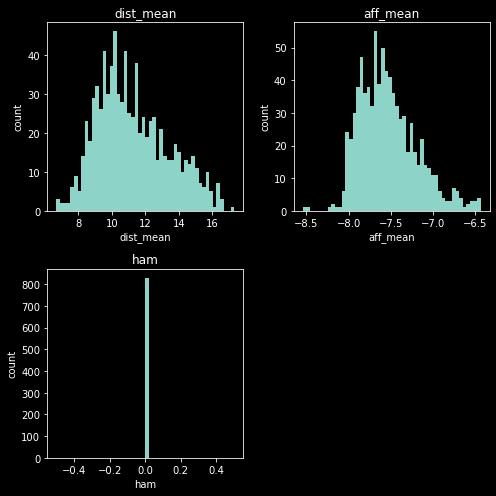
    


## TSNEs
Run with `tsne.py`


```python
tsa = pd.read_csv('tsne-a.csv', index_col=0)
tsb = pd.read_csv('tsne-b.csv', index_col=0)
tsb.head()
```


<div>
<style scoped>
    .dataframe tbody tr th:only-of-type {
        vertical-align: middle;
    }

    .dataframe tbody tr th {
        vertical-align: top;
    }

    .dataframe thead th {
        text-align: right;
    }
</style>
<table border="1" class="dataframe">
  <thead>
    <tr style="text-align: right;">
      <th></th>
      <th>0</th>
      <th>1</th>
    </tr>
  </thead>
  <tbody>
    <tr>
      <th>0</th>
      <td>-2.372991</td>
      <td>-3.393541</td>
    </tr>
    <tr>
      <th>1</th>
      <td>-16.840439</td>
      <td>-6.954678</td>
    </tr>
    <tr>
      <th>2</th>
      <td>18.324680</td>
      <td>-16.444464</td>
    </tr>
    <tr>
      <th>3</th>
      <td>8.079386</td>
      <td>-3.024531</td>
    </tr>
    <tr>
      <th>4</th>
      <td>7.071154</td>
      <td>10.529802</td>
    </tr>
  </tbody>
</table>
</div>


## Experiment A
- Hamming distance is 0 in the middle - that's where the template is
- Affinity score is also low there, which suggests the template and maybe mutants close to it bind mesotrione tightly
- Theres a cluster on the left with a good (low) score around 5-7 - need to look at that


```python
fig, ax = plt.subplots(2,2,figsize=(10,10))
cols = ['aff_mean', 'score', 'dist_mean', 'ham']
for i, j in zip(cols, ax.flatten()):
    plot = j.scatter(x=tsa['0'], 
                     y=tsa['1'],
                     s=0.1,
                     c=dfa[i],
                     )
    j.set_title(f'Experiment A TSNE color mapped to {i}')
    fig.colorbar(plot, ax=j, label=i)

plt.show()
```


    
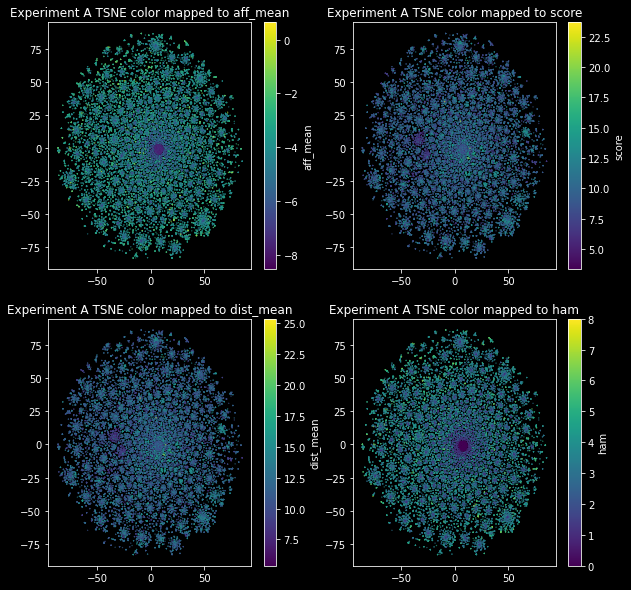
    


## Experiment B
Similar story here except no cluster that's clearly better than the others - except maybe that one in the top left.


```python
fig, ax = plt.subplots(2,2,figsize=(10,10))
cols = ['aff_mean', 'score', 'dist_mean', 'ham']
for i, j in zip(cols, ax.flatten()):
    plot = j.scatter(x=tsb['0'], 
                     y=tsb['1'],
                     s=0.1,
                     c=dfb[i],
                     )
    j.set_title(f'Experiment B TSNE color mapped to {i}')
    fig.colorbar(plot, ax=j, label=i)

plt.show()
```


    
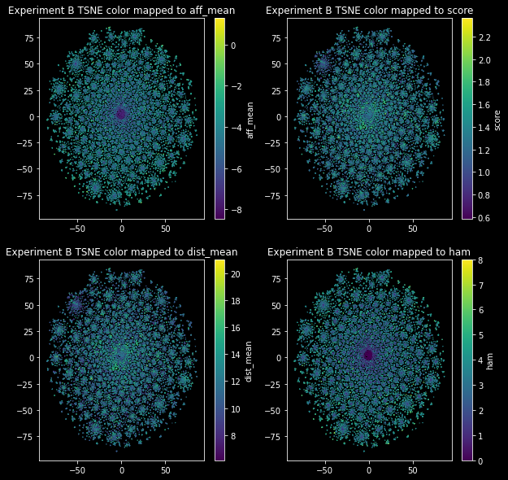
    


```python
plt.hist(dfa.dist_mean, bins=50)
plt.show()
```


    
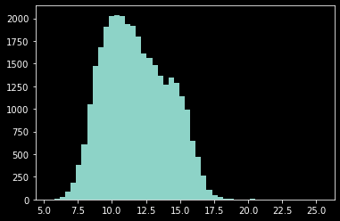
    


```python
ba = dfa.loc[dfa.dist_mean < 10,:]
sns.pairplot(ba, kind='kde')
plt.show()
```


    
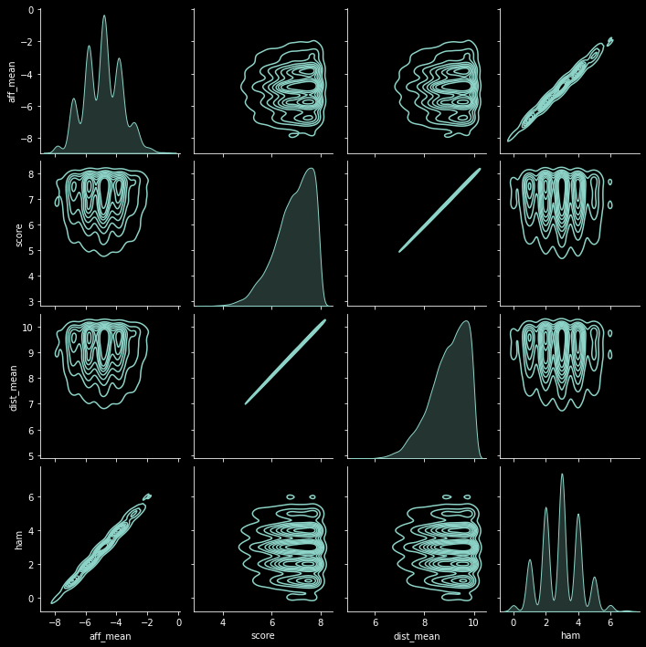
    


## Pareto front?
3 mutations might be ok?
Template is the most populer


```python
ba_vc = ba.gene.value_counts()
ba_vc
```


    RTYLVTKHPTVALFSERTIAAAAGL    120
    RTYLVTKRPTVALFSERTIAAAAGL     14
    RTYGVTKHPTVALFSERTIAAAAGL     13
    RTYPVTKHPTVALFSERTIAAAAGL     11
    RTYLVLKHPTVALFSERTIAAAAGL     10
                                ... 
    RTYLVTKHDPVALASECTIAAAADL      1
    RTYLVTGHPTVAAFSENTIAAAAGL      1
    RTQLVTKHPTVALWSEGTIAAAADL      1
    RTYLVTKHRYVALFSECTIAAAAGL      1
    RTYLVLPHPTVALFSERTIKAAAGL      1
    Name: gene, Length: 7323, dtype: int64


```python
ba_vc.index[0] == template_gene
```


    True


```python
plt.hist(ba_vc[1:],bins=50)
plt.xlabel('number of number of duplicates')
#plt.xscale('log')
plt.xticks(range(14),range(14))
plt.show()
```


    
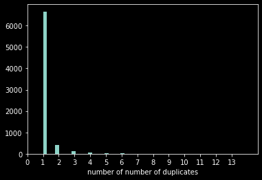
    


```python
x = ba_vc.loc[ba_vc > 3]
x
```


    RTYLVTKHPTVALFSERTIAAAAGL    120
    RTYLVTKRPTVALFSERTIAAAAGL     14
    RTYGVTKHPTVALFSERTIAAAAGL     13
    RTYPVTKHPTVALFSERTIAAAAGL     11
    RTYLVLKHPTVALFSERTIAAAAGL     10
                                ... 
    RRYLVTKHPTVALFSERTIAAAAGL      4
    RTYLVTKHPTNALFSERTIAAAAGL      4
    RTYLVTNHPTVALFSERTIAAAAGL      4
    KTYLVTKHPTVALFSERTIAAAAGL      4
    RTYLVTKHPFVALFSERTIAAAAGL      4
    Name: gene, Length: 110, dtype: int64


```python

```


```python
sns.kdeplot(x=ba.ham, 
            y=ba.dist_mean)
plt.show()
```


    
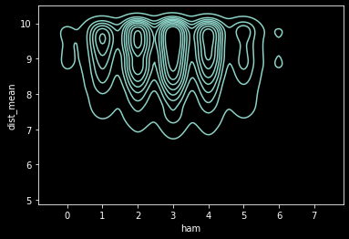
    


```python
plt.hist(dfb.score, bins=50)
plt.xlabel('score b')
plt.title('experiment b')
plt.show()
```


    
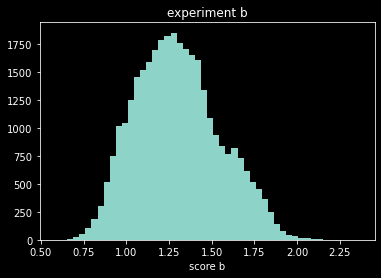
    


```python
plt.hist(dfb.dist_mean, bins=50)
plt.xlabel('dist_mean')
plt.title('experiment b')
plt.show()
```


    
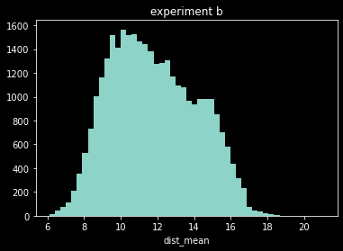
    


```python
bb = dfb.loc[dfb.dist_mean < 10, :]
bb
```


<div>
<style scoped>
    .dataframe tbody tr th:only-of-type {
        vertical-align: middle;
    }

    .dataframe tbody tr th {
        vertical-align: top;
    }

    .dataframe thead th {
        text-align: right;
    }
</style>
<table border="1" class="dataframe">
  <thead>
    <tr style="text-align: right;">
      <th></th>
      <th>gene</th>
      <th>aff_mean</th>
      <th>score</th>
      <th>dist_mean</th>
      <th>ham</th>
      <th>uid</th>
    </tr>
  </thead>
  <tbody>
    <tr>
      <th>8</th>
      <td>RTYLVTKHPTVALFSERVIAAAAGL</td>
      <td>-6.800000</td>
      <td>1.102021</td>
      <td>9.690085</td>
      <td>1</td>
      <td>aeose</td>
    </tr>
    <tr>
      <th>11</th>
      <td>RTYLVTKHPTVALFSERTIAAAAGL</td>
      <td>-7.833333</td>
      <td>1.105123</td>
      <td>9.710878</td>
      <td>0</td>
      <td>xlvpi</td>
    </tr>
    <tr>
      <th>12</th>
      <td>RTYLVTKHPTVPLFSERTIAAAAGL</td>
      <td>-6.866667</td>
      <td>1.075939</td>
      <td>9.600841</td>
      <td>1</td>
      <td>emxjh</td>
    </tr>
    <tr>
      <th>13</th>
      <td>RTYLVTKHPTVALESERTIAAAAGL</td>
      <td>-6.511111</td>
      <td>1.156873</td>
      <td>9.639508</td>
      <td>1</td>
      <td>tupjx</td>
    </tr>
    <tr>
      <th>19</th>
      <td>RTYLVTKHPTVALFSMRTIAAAAGL</td>
      <td>-6.677778</td>
      <td>1.075496</td>
      <td>9.105535</td>
      <td>1</td>
      <td>orepb</td>
    </tr>
    <tr>
      <th>...</th>
      <td>...</td>
      <td>...</td>
      <td>...</td>
      <td>...</td>
      <td>...</td>
      <td>...</td>
    </tr>
    <tr>
      <th>32748</th>
      <td>RTYTVTKHPCVALFSERTIAAAAKL</td>
      <td>-4.577778</td>
      <td>1.209347</td>
      <td>9.861749</td>
      <td>3</td>
      <td>znpmt</td>
    </tr>
    <tr>
      <th>32749</th>
      <td>RTYLVFKNPTVALFSERTIAGAAGL</td>
      <td>-5.055556</td>
      <td>1.022449</td>
      <td>9.707138</td>
      <td>3</td>
      <td>tiofe</td>
    </tr>
    <tr>
      <th>32753</th>
      <td>RTYSVTKRPGTALFSERTIAAAAGL</td>
      <td>-4.044444</td>
      <td>0.900862</td>
      <td>8.150650</td>
      <td>4</td>
      <td>qwgbq</td>
    </tr>
    <tr>
      <th>32757</th>
      <td>RTYLVTKPATDALFSEDTIAAAAGL</td>
      <td>-3.900000</td>
      <td>0.904599</td>
      <td>8.567520</td>
      <td>4</td>
      <td>rprgh</td>
    </tr>
    <tr>
      <th>32759</th>
      <td>RTYSVTKRPTTALFSEDTIAAAAGV</td>
      <td>-3.155556</td>
      <td>1.009642</td>
      <td>9.148842</td>
      <td>5</td>
      <td>rddig</td>
    </tr>
  </tbody>
</table>
<p>8498 rows × 6 columns</p>
</div>


```python
sns.pairplot(bb,kind='kde')
plt.show()
```


    
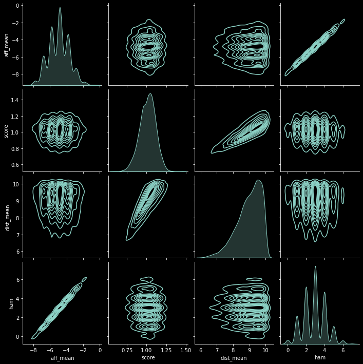
    


```python
bb
```


<div>
<style scoped>
    .dataframe tbody tr th:only-of-type {
        vertical-align: middle;
    }

    .dataframe tbody tr th {
        vertical-align: top;
    }

    .dataframe thead th {
        text-align: right;
    }
</style>
<table border="1" class="dataframe">
  <thead>
    <tr style="text-align: right;">
      <th></th>
      <th>gene</th>
      <th>aff_mean</th>
      <th>score</th>
      <th>dist_mean</th>
      <th>ham</th>
      <th>uid</th>
    </tr>
  </thead>
  <tbody>
    <tr>
      <th>8</th>
      <td>RTYLVTKHPTVALFSERVIAAAAGL</td>
      <td>-6.800000</td>
      <td>1.102021</td>
      <td>9.690085</td>
      <td>1</td>
      <td>aeose</td>
    </tr>
    <tr>
      <th>11</th>
      <td>RTYLVTKHPTVALFSERTIAAAAGL</td>
      <td>-7.833333</td>
      <td>1.105123</td>
      <td>9.710878</td>
      <td>0</td>
      <td>xlvpi</td>
    </tr>
    <tr>
      <th>12</th>
      <td>RTYLVTKHPTVPLFSERTIAAAAGL</td>
      <td>-6.866667</td>
      <td>1.075939</td>
      <td>9.600841</td>
      <td>1</td>
      <td>emxjh</td>
    </tr>
    <tr>
      <th>13</th>
      <td>RTYLVTKHPTVALESERTIAAAAGL</td>
      <td>-6.511111</td>
      <td>1.156873</td>
      <td>9.639508</td>
      <td>1</td>
      <td>tupjx</td>
    </tr>
    <tr>
      <th>19</th>
      <td>RTYLVTKHPTVALFSMRTIAAAAGL</td>
      <td>-6.677778</td>
      <td>1.075496</td>
      <td>9.105535</td>
      <td>1</td>
      <td>orepb</td>
    </tr>
    <tr>
      <th>...</th>
      <td>...</td>
      <td>...</td>
      <td>...</td>
      <td>...</td>
      <td>...</td>
      <td>...</td>
    </tr>
    <tr>
      <th>32748</th>
      <td>RTYTVTKHPCVALFSERTIAAAAKL</td>
      <td>-4.577778</td>
      <td>1.209347</td>
      <td>9.861749</td>
      <td>3</td>
      <td>znpmt</td>
    </tr>
    <tr>
      <th>32749</th>
      <td>RTYLVFKNPTVALFSERTIAGAAGL</td>
      <td>-5.055556</td>
      <td>1.022449</td>
      <td>9.707138</td>
      <td>3</td>
      <td>tiofe</td>
    </tr>
    <tr>
      <th>32753</th>
      <td>RTYSVTKRPGTALFSERTIAAAAGL</td>
      <td>-4.044444</td>
      <td>0.900862</td>
      <td>8.150650</td>
      <td>4</td>
      <td>qwgbq</td>
    </tr>
    <tr>
      <th>32757</th>
      <td>RTYLVTKPATDALFSEDTIAAAAGL</td>
      <td>-3.900000</td>
      <td>0.904599</td>
      <td>8.567520</td>
      <td>4</td>
      <td>rprgh</td>
    </tr>
    <tr>
      <th>32759</th>
      <td>RTYSVTKRPTTALFSEDTIAAAAGV</td>
      <td>-3.155556</td>
      <td>1.009642</td>
      <td>9.148842</td>
      <td>5</td>
      <td>rddig</td>
    </tr>
  </tbody>
</table>
<p>8498 rows × 6 columns</p>
</div>


```python
bb.gene.value_counts()
```


    RTYLVTKHPTVALFSERTIAAAAGL    144
    RTYSVTKHPTVALFSERTIAAAAGL     19
    RTYLVFKHPTVALFSERTIAAAAGL     15
    RTYLGTKHPTVALFSERTIAAAAGL      8
    RTYLVTKQPTVALFSERTIAAAAGL      8
                                ... 
    RTYLVTNHPKVALISEETIAAAAGL      1
    RTYLVTKHRTVKLFSERTIAAAAGL      1
    RTYLVTKHPTVKLFSERFIAAAAGL      1
    RTDLVTKHPTIALFSERTIAAAAGF      1
    RTYSVTKRPTTALFSEDTIAAAAGV      1
    Name: gene, Length: 7255, dtype: int64


## Does value count correlate with fitness?


```python
import numpy as np

vc = df_.gene.value_counts()
vc_ = vc.loc[vc > 1]
vc_fitness = {i:df_.loc[df_.gene == i, 'dist_mean'].tolist() \
              for i in vc_.index}

xy = np.array(\
              [[i,k] for i,j in zip(vc_, vc_.index) \
                   for k in vc_fitness[j]]\
             )
sns.kdeplot(xy[:,0], xy[:,1])
plt.ylabel('dist_mean')
plt.xlabel('value count')
plt.show()

plt.scatter(xy[:,0], xy[:,1], s=1, alpha=0.5)
plt.ylabel('dist_mean')
plt.xlabel('value count')
plt.show()
```

    /home/u0/miniconda3/lib/python3.8/site-packages/seaborn/_decorators.py:36: FutureWarning: Pass the following variable as a keyword arg: y. From version 0.12, the only valid positional argument will be `data`, and passing other arguments without an explicit keyword will result in an error or misinterpretation.
      warnings.warn(


    
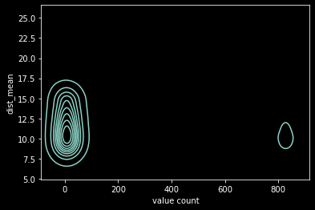
    


    
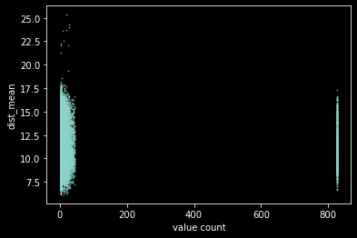
    


```python
vc = df_.gene.value_counts()
vc_ = vc.loc[vc > 1]
vc_ = vc.loc[vc < vc_.max()]
vc_fitness = {i:df_.loc[df_.gene == i, 'dist_mean'].tolist() \
              for i in vc_.index}

xy = np.array(\
              [[i,k] for i,j in zip(vc_, vc_.index) \
                   for k in vc_fitness[j]]\
             )

sns.kdeplot(xy[:,0], xy[:,1])
plt.ylabel('dist_mean')
plt.xlabel('value count')
plt.show()

plt.scatter(xy[:,0], xy[:,1], s=1, alpha=0.5)
plt.ylabel('dist_mean')
plt.xlabel('value count')
plt.show()
```

    /home/u0/miniconda3/lib/python3.8/site-packages/seaborn/_decorators.py:36: FutureWarning: Pass the following variable as a keyword arg: y. From version 0.12, the only valid positional argument will be `data`, and passing other arguments without an explicit keyword will result in an error or misinterpretation.
      warnings.warn(


    
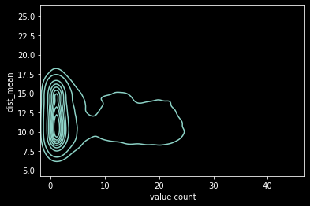
    


    

    


## Sequence Logo
The template sequence predominates. Dang.


```python
import logomaker

dfag = pd.DataFrame([list(i) for i in dfa.gene])
dfag_c = pd.concat([dfag[i].value_counts() for i in dfag],
         axis=1).fillna(0)
dfag_c /= dfag_c.sum(axis=0)

MXN_SITES = [47, 49, 51, 75, 78, 88, 94, 138, 142, 175, 178, 
             184, 188, 205, 226, 252, 255, 260, 263, 290, 295, 
             328, 330, 350, 353]

print(template_gene)
print(len(MXN_SITES))
print(len(template_gene))

plt.style.use('seaborn-dark')
logo = logomaker.Logo(dfag_c.T, color_scheme='chemistry')
plt.xlabel('Position')
plt.ylabel('Frequency')
plt.xticks(range(len(MXN_SITES)), MXN_SITES, rotation=70)
plt.show()
```

    RTYLVTKHPTVALFSERTIAAAAGL
    25
    25


    
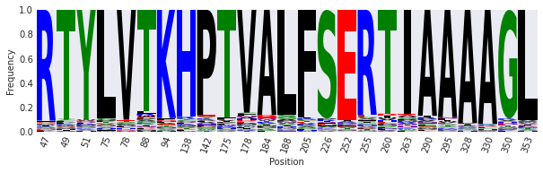
    


## Model
`nn.py` was an attempt to model this dataset with a simple feed forward neural network, predicting `dist_mean`. 
Didn't go very well.

Options for continuing `nn.py`:
- Different normalization/scaling
- aggregate all old data from trial runs
- resample data for balancing
    - ???
- Feature engineering
    - aa embedding
- ESM transfer - need a GPU for that though. can prototype on a cpu machine.

Trying a random forest here


```python
from numpy import concatenate as cat
from numpy import zeros 
from sklearn.ensemble import RandomForestRegressor

model = RandomForestRegressor()

def ohe(gene, dim=0):
    AAS = dict(zip('ACDEFGHIKLMNPQRSTVWY', range(20)))
    fn = lambda string : [AAS[i] for i in string]
    o = []
    for i in gene:
        x = zeros((1,len(AAS)))
        x[0, fn(i)] = 1.
        o.append(x)
    return cat(o, axis=dim)

def min_max_scale(x):
    x_ = x - min(x)
    x_ = x_ / max(x_)
    return x_

x = cat([ohe(i,dim=1) for i in df_.gene])
y = min_max_scale(df_.dist_mean)
print(x.shape)
print(y.shape)
```

    (65559, 500)
    (65559,)


## Could normalize that better


```python
plt.style.use('dark_background')
sns.kdeplot(y.values)
plt.show()
```


    
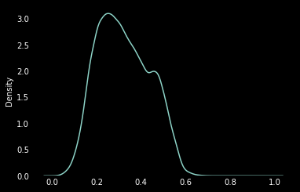
    


```python
from sklearn.preprocessing import MinMaxScaler, RobustScaler, StandardScaler
plt.style.use('dark_background')
l = [MinMaxScaler, RobustScaler, StandardScaler]
fig, ax = plt.subplots(2,2, figsize=(10,10))
for i, j in zip(l, ax.flatten()):
    scaler = i()
    y_ = scaler.fit_transform(df_[['dist_mean']].values)
    sns.kdeplot(y_.reshape(-1), ax=j)
    j.set_title(str(i).split('.')[-1])
ax[1][1].set_axis_off()
plt.tight_layout()
plt.show()
```


    
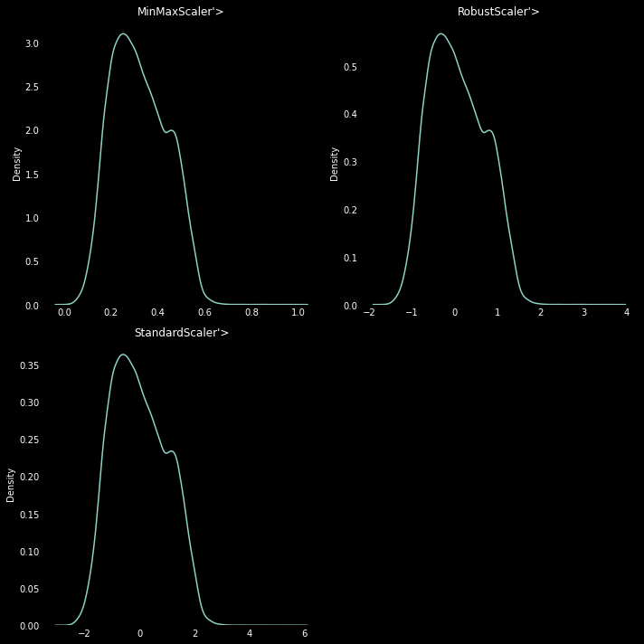
    


```python
from sklearn.model_selection import train_test_split


x_train, xtest, y_train, y_test = train_test_split(x,y, test_size=0.25)
model.fit(x_train,y_train)
```


    RandomForestRegressor()


```python
yh_test = model.predict(xtest)
plt.style.use('dark_background')
sns.kdeplot(x=y_test.values, y=yh_test)
plt.plot([0,1],[0,1])
plt.xlim(0,1)
plt.ylim(0,1)
plt.xlabel('actual')
plt.ylabel('predicted')
plt.show()
```


    
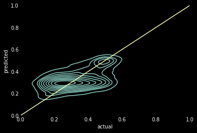
    


```python
from einops import rearrange

arr = rearrange(model.feature_importances_, '(a b) -> a b', a=20, b=25)

plt.set_cmap('viridis')
sns.heatmap(arr)
plt.xticks(range(len(MXN_SITES)), MXN_SITES, rotation=70)
plt.yticks(range(20), list('ACDEFGHIKLMNPQRSTVWY'))
plt.show()
```


    
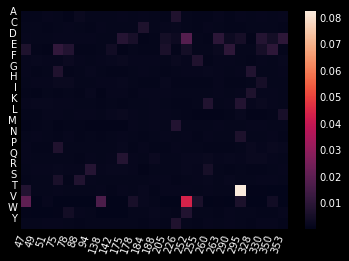
    


```python
import numpy as np

def ens_pred(model, x):
    return np.array([i.predict(x) for i in model.estimators_]).T

print(xtest.shape)
ens_pred(model, xtest).shape
```

    (16390, 500)


    (16390, 100)


```python
def check(n):
    sns.kdeplot(ens_pred(model,xtest[n].reshape(1,-1)).reshape(-1))
    plt.vlines(x=y_test.values[n], 
               ymin=0,
               ymax=16,
               label='actual')
    plt.vlines(x=model.predict(xtest[n].reshape(1,- 1)), 
               ymin=0,
               ymax=16,
               linestyles='--')
    plt.xlim(0,1)
    plt.show()
    
import random
check(random.randint(0, len(y_test)))
```


    
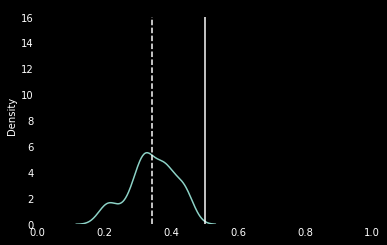
    

