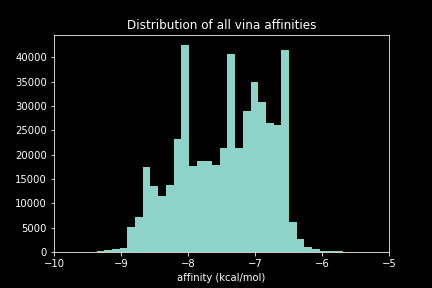

# Results 

## About
Experiments were oriented to iterative improvements to the Virtual Directed Evolution (VDE) system.

## Experiments $A$ & $B$
### About
Experiments $A$ & $B$ compared performance of two score fuctions, $A$ and $B$.

$$
fn_a(poses) = mean(poses_{affinities} \times log(abs(poses_{distances})))
$$

$$
fn_b(poses) = mean(softmax(|poses_{affinities}|) \times poses_{distances})
$$

Where $distances$ is the set of distances between mesotrione $C_4$ and the heme iron in Angstroms for each pose, which maps to $affinities$: the `vina` scores - approximations to the change in free energy $\Delta G$ on binding in that conformation ($kcal / mol$).

The $C_4$ carbon was mistakenly targeted over $C_5$ for these experiments.
This was because of atom renumbering by `obabel` when converting the SMILES string to a `.pdbqt`.

The new numbering scheme sets $C_4$ as $C_{20}$ and $C_{5}$ to $C_{19}$.
Below is a graph generated from the 3D coordinates of a mesotrione pose where nodes are atoms and edges are distances below $3?A$, showing the new numbering.

Despite this discrepancy, the $C_{20}$ and $C_{19}$-heme iron distances correlate tightly.
The data generated is likely useful to a degree in the enzyme engineering task, but very useful in terms of evaluating and improving the process.

### Experiments A and B Configuration
Experiments A and B were run each in eight independent replicates in parrallel.
The only difference between the two experiments were the score functions, $A$ and $B$.
Experiments A and B were run with the following configuration:

|                | Experiment A                                                                                                                   | Experiment B                                                                                                                   |
|:---------------|:-----------------------------------------------------------------------------------------------------------------------|:-----------------------------------------------------------------------------------------------------------------------|
| POP_SIZE       | 128                                                                                                                      | 128                                                                                                                    |
| N_GENERATIONS  | 32                                                                                                                      | 32                                                                                                                     |
| SURVIVAL       | 0.25                                                                                                                   | 0.25                                                                                                                   |
| EXHAUSTIVENESS | 16                                                                                                                      | 16                                                                                                                     |
| VOCAB          | ACDEFGHIKLMNPQRSTVWY                                                                                                   | ACDEFGHIKLMNPQRSTVWY                                                                                                   |
| MXN_SITES      | [47, 49, 51, 75, 78, 88, 94, 138, 142, 175, 178, 184, 188, 205, 226, 252, 255, 260, 263, 290, 295, 328, 330, 350, 353] | [47, 49, 51, 75, 78, 88, 94, 138, 142, 175, 178, 184, 188, 205, 226, 252, 255, 260, 263, 290, 295, 328, 330, 350, 353] |
| Score Function      | $A$ | $B$ |

Notably, the `vina` exhaustiveness parameter is 16 in both experiments. 
This reduces the noise in docking results at the expense of computational resources, which extends the experiment runtime and the cost of renting the cloud machines.

Also, the set of mutation sites is large and lines the active site. 
This limits the effectiveness of the simple genetic algorithm used here.
A larger population size can offset the large search space, but some multiprocessing issues in `pyrosetta` revent effective parrallelism in a single process using `python` multiprocessing builtin libraries.
That said, the major bottleneck in each iteration is docking with `vina`, so expending extra time predicting structures may be worthwhile. 

For each experiment, metrics data from each of eight runs was aggregated.
The data were distributed as:

One notable feature of the distributions is the $Hamming Distance$ - `ham`, which rarely exceeds 5.
Since the only constraint on $Hamming Distance$ was a penalty in the score function, the distribution suggests that the constraint is effective at steering the search algorithm towards local sequences.

`score` and `dist_mean` distributions are skewed left from normal, which suggests that the data tends towards low scores, which is promising because low scores were the optimisation objective.

Another feature of the distributions is the unevenness of the mean $Affinity$ scores in each.
When affinities of all poses from both runs are considered individually, they are distributed as:

It is worth noting that the precision of `vina` scores is to two decimal places, which effectively rounds scores into bins.
Despite that, there appear to be five preferred affinities, which may map to five clusters of poses.

There are $N$ variants on each experiment with a Hamming Distance of 0. 
No experiments were initialised with the template sequence.
Instead they were initialised with a population of size $p$ where each member is one mutation from the template.
Therefore the template sequence replicates were reaced during the exploration of sequence space.
Despite the incentive to generate sequences close to the template, the low incidence of template sequences suggests that they are non-optimal.

### Pairwise Correlations
To search for correlations between metrics in each experiment, pairplots of all metrics were generated:

#### Experiment A Pairwise

#### Experiment B Pairwise

There are two noteworthy correlations:

1. Scores correlate with `dist_mean`, `aff_mean` and `ham`. This is unsurprising because scores are a function of these metrics.
2. Hamming Distance correlates with `aff_mean`. The correlation is surprisingly direct, and may suggest that most mutations are detrimental to binding. This correlation is regarded with caution, since Hamming Distance is considered by the optimizer, so sampling is very biased.

### TSNEs
To visualize the populations as wholes and potentially identify fit clusters of mutants, a dimensionality reduction algorithm - T-Stochastic Neighbour Embedding (TSNE) was used to place mutants in 2D space based on their similarity to one another.

Input to the TSNE were the one-hot encoded genes.
Limitations of this encoding scheme are that  there is no notion of similarity between amino acids - each encoding is equidistant from one another by any metric (e.g. Tanimoto distance).

The resulting point clouds were mapped to the experiment metrics by color and plotted:

#### Experiment B TSNE

#### Experiment B TSNE

In both projections, template variants and those close to it are in the center - demonstrated by the mapping of Hamming Distance to the points. 
This is because they are likely to have more neighours than more distant sequences, so placing them centrally is optimal.

It is hard to determine if the other clusters in the plots are an artifact of the TSNE algorithm, or legitimate clusters.
A more effective dimensionality reduction algorithm may be Uniform Manifold Approximation and Projection (UMAP) `\ref`.

!!! todo
	umap projection

### Top Scoring Mutants

!!! todo
	get best

### logo a b
To identify prevalent mutations in both Experiments $A$ and $B$, sequence logos for each set of experimental data were constructed.
In these plots, letter height corresponds to the corresponding amino acid frequency in the set of sequences.

An aggregate of experiments $A$ and $B$ shows a prevalence of the template amino acids.
This is not unexpected, given that Hamming Distance was constrained in these experiments.

!!! todo
	- individual logos
	- logos without template amino acids

### Most Prevalent Mutations
Prevalence of a particular mutant in a pool could be explained either by its fitness leading to its enrichment, its proximity to the template sequence making revisits more likely, or a combination of the two.

When the prevalence (count) of each mutant is plotted against fitness metrics, the data is distributed as:

The extreme prevalence of the template sequence in this set obscures any possible correlation. 
When the template sequence counts are excluded, the data is distributed as:

Once again there are no clear correlations, except between the count and Hamming Distance, which may be the result of revisits unrelated to fitness, or because there are fit mutants within one mutation of the template.

### Surrogate Models
Machine learning models were trained on the synthetic data in an attempt to:

1. Create fast gene fitness approximators for increasing throughput by orders of magnitude
2. Identify key mutations for conferring the target fuctionality

Initially a random forest regression model `\ref` was fit to the data `\params`, using the one-hot encoded gene sequences as input and the mean affinities as output.
Mean affinites were chosen as an output becuase they were comparable between experiment $A$ and $B$, allowing the use of a dataset with 60,000 points, rather than 30,000.

Prior to training, mean affinities were normalized using min-max scaling, where data are scaled linearly between 0 and 1.
Several normalization strategies were compared:

MinMax scaling was chosen, but a notable shortcoming of this technique in its raw form is its sensitivity to outliers, which results in scaling of most points between 0 and 0.6, rather than 0 and 1.
Despite this, the model was trained on this scaled distribution of mean affinities.

20 % of the training data was held out for model validation.
Below is the distribution of predicted vs actual values for the held-out set.
It shows that there is only a slight correlation between the predicted and actual values.

The distribution of the training data is reflected in the predictions.
The shoulder of high affinities is predicted well by the model, but the majority of normalized affinities - between 0.2 and 0.4 - are close to random.

The following changes can be made to the model to improve its performance:

1. Use of a different amino acid encoding scheme that better refelcts their relationship to one another, their physical and chemical properties, for example.
2. Removal of outliers from the dataset, which would improve normalization and may improve the training process.

In anticipation of a better fitting model in the future, work was done to use the model to identify key mutations that contribute to fitness improvements.
Random Forest models can assign feature importance to inputs, which were generated from the trained model annd shown below.

The heatmap maps feature importance to each amino acid at each position.
The positive or negative effect of each input on fitness can not be attained from the feature importances, only that they are important.

Accordingly, the model identifies some key mutations as: V47, V138, V252 and T295.
However, given the poor performance of the model, these values are not passed forward as valuable information.
The potential value is the method of identifying key mutations using a trained model.

Another application of a trained model is as a cheap surrogate function to the expensive function that generated the data.
Using a trained model, sequences can be evaluated orders of magnitude faster.

An important consideration in this case is the handling of uncertainty of predictions from out-of-distribution (OOD) data.
The training set contains sequences close to the template sequence, so is inherently biased.

Since random forest models are ensembles of many decision trees, estimates of model uncertainty can be generated by considering the spread of predictions from each tree. 
A wide spread of predictions indicates model uncertainty, which can be used to place value on certain predctions rather than uncertain ones.

## Analysis of score functions $A$ and $B$
### score a vis

### score b vis

### Lessons from Experiments $A$ and $B$

## Experiment $C$

## Experiment $D$

### Mutant Design
### Degenerate Codon Design
### Site Directed Mutagenesis Design
