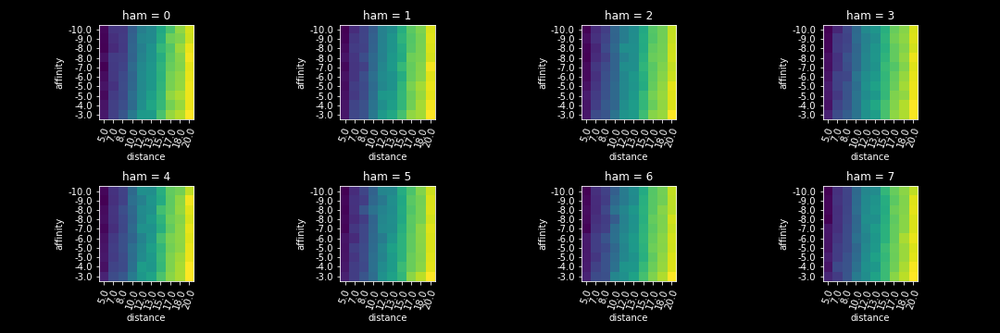

# Results 

## About
Experiments were oriented to iterative improvements to the Virtual Directed Evolution (VDE) system.

## Experiments $A$ & $B$
### About
Experiments $A$ & $B$ compared performance of two score fuctions, $A$ and $B$.

$$
fn_a(poses) = mean(poses_{affinities} \times log(abs(poses_{distances})))
$$

$$
fn_b(poses) = mean(softmax(|poses_{affinities}|) \times poses_{distances})
$$

!!! warning
	correct config

|                | expa                                                                                                                   | expb                                                                                                                   |
|:---------------|:-----------------------------------------------------------------------------------------------------------------------|:-----------------------------------------------------------------------------------------------------------------------|
| POP_SIZE       | 512                                                                                                                      | 128                                                                                                                    |
| N_GENERATIONS  | 32                                                                                                                      | 32                                                                                                                     |
| SURVIVAL       | 0.25                                                                                                                   | 0.25                                                                                                                   |
| EXHAUSTIVENESS | 16                                                                                                                      | 16                                                                                                                     |
| VOCAB          | ACDEFGHIKLMNPQRSTVWY                                                                                                   | ACDEFGHIKLMNPQRSTVWY                                                                                                   |
| MXN_SITES      | [47, 49, 51, 75, 78, 88, 94, 138, 142, 175, 178, 184, 188, 205, 226, 252, 255, 260, 263, 290, 295, 328, 330, 350, 353] | [47, 49, 51, 75, 78, 88, 94, 138, 142, 175, 178, 184, 188, 205, 226, 252, 255, 260, 263, 290, 295, 328, 330, 350, 353] |

### score a vis

### score b vis

### exp  hists

### exp a pairplot

### exp b pairplot

### exp a tsne

### exp b tsne

### logo a b

### Description of Mutants Screened
- **Data Visualizations**
### Mutation Convergence 
### Contact Analysis
### Mutant Design
### Degenerate Codon Design
### Site Directed Mutagenesis Design
## Lab Results
### Binding
### Turnover
### Prooduct Formation
