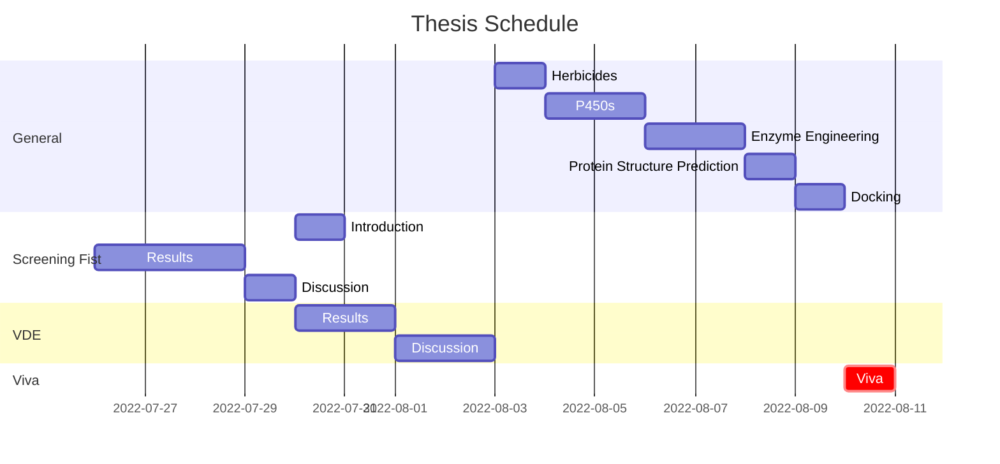

# Thesis

## Objectives

- [ ] **General :**
	- [ ] **HPPD Herbicides :**
		- [ ] **Scaffold :**
		- [ ] **Dock to ntHPPD :**
		- [ ] **Dock to Cyp72A1 :**
	- [ ] **P450s :**
	- [ ] **Enzyme Engineering :**
	- [ ] **Protein Structure Prediction :**
	- [ ] **Docking :**
- [ ] **Screening Fist:**
	- [ ] **Results:**
		- [ ] **Screening Data:** Describe
		- [ ] **Model Training:** Describe
		- [ ] **Generated Proteins:** Do, Describe
	- [ ] **Discussion:**
		- [ ] **Issues:**
		- [ ] **Improvements:**
- [ ] **VDE:**
	- [ ] **Results:**
	- [ ] **Discussion:**
		- [ ] **Issues:**
		- [ ] **Improvements:**

