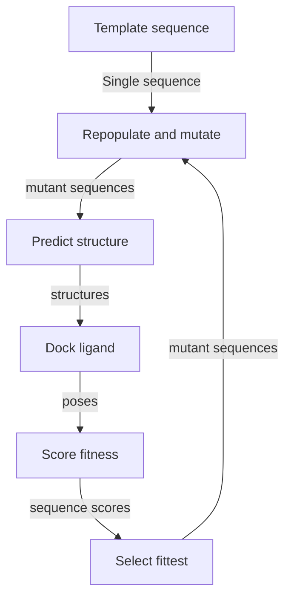
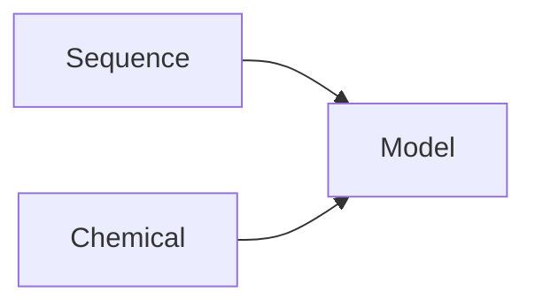

# Overview of Engineering Task

## Contents

## Abstract
Global agriculture relies heavily on herbicides use to minimize yeild loss due to weeds, which can be significant. 
An issue is that no new herbicide classes have been discovered in [decades](how long?), which coupled with frequent outbreaks of herbicide resistant weeds leaves an un-met demand for more effective weed control technology.
Engineered herbicide resistant crops are an effective solution to this problem since they allow farmers flexibility in their herbicide application programs, minimizing the risk of a resistance outbreak.
Their widespread adoption would also enable development of badly needed new herbicide chemistries.

Herbicide resistance can be engineered by augmentation of the metabolic pathways affected by the herbicide (metabolic bypassing) or by inserting herbicide detoxification machinery.
The latter can require enzyme engineering, which is the focus of this project.

The goal of this project is to develop enzymes to initiate detoxification of the herbicide [mesotrione](https://pubchem.ncbi.nlm.nih.gov/compound/Mesotrione), which belongs to an important class of herbicides that inhibit 4-HPPD.


To do this, two enzyme engineering techniques are developed and deployed. 

One technique relies on virtual directed evolution - using automated cycles of protein structure-prediction, molecular docking and mutation by a genetic algorithm. 
Thousands of mutants are screened virtually and several candidates are generated for lab testing.
Lab tests on the candidates show : ...

The other technique relies on a machine learning model that maps protein sequence to substrate specificty, which can evaluate a large number of sequences quickly.
The model in combination with a sequence optimization algorithm can generate candidates for lab testing.
The model, trained on in-house P450-ligand screening data can also plan subsequent rounds of screening based on its uncertainty and the expected information gain of a particular experiment.

|||
||| 
| |Mesotrione, the detoxification target for this work, is a 4-HPPD inhibitor representative of the triketone class of HPPD inhibitor.|


## Problem Context
Herbice detoxification in plants is typically initiated by a ring carbon hydroxylation by a cytochrome P450 before conjugation with glutathione by a glutathione S-transferase (GST) and sequestration into a vacuole by an [ABC transporter](really?).
GSTs can be promiscuous so it may be sufficient to introduce an engineered cytochrome P450 capable of mesotrione ring hydroxylation to render a crop herbicide tolerant.
Therefore the aim of the project is to engineer a cytochrome P450 capable of a non-site specific ring hydroxylation of mesotrione.

A promising template is the cytochrome P450 BM3 from *Bacillus megatarium*, which has been extensively studied, characterized and engineered for non-natural activity.
BM3 has the fastest reaction rates of any P450 towards its presumed natural substrate, arachadionic acid, at 17000 MS<sup>-1</sup> because it is naturally fused to its reductase domain.
This, combined with its ease of expression, broad engineered substrate scope and  tolerance to mutations makes BM3 a suitable template for engineering a herbicide detoxification system.

Pilot studies indicate that neither the wild-type or the promiscuous A82F/F87V mutant have binding activity towards mesotrione.

## Resources Available
Candidate solutions were devised within the constraints of the resources available.
The resources included that necesseray to perform a high throughput screen of P450 ligand binding and the compute necesseray to build a large neural model of sequence-substrate specificty, and to run rounds of virtual directed evolution.

### Screening Equipment
Screening equipment available included:

- **Labcyte Echo** - an acoustic liquid handling system that can dispense small volumes plate-to-plate with 2.5 nl precision. Various models exist and all can follow arbitary dispensing instructions from a `csv` file.
- **Thermo-Fisher Multidrop** - a bulk liquid dispensing system for transfer of a liquid to a microplate with speed and precision.
- **BMG FluoStar Plate Readers** - micro plate readers that can measure the UV/visibile light absorbance between 300 and 800 nm in transparent plates.

### Compute

- **CPUs**
- **GPUs**

## Proposed Solutions
Two techniques are developed and field tested in this work. 
One is computer program (reffered to here as `evo`) which simulates directed evolution by cycles of structure prediction ligand docking and mutation, directed by a genetic algorithm.

The other aims to map P450 sequence to substrate specificty with a machine learning model that directs an enzyme-ligand screening program in the lab by active learning.
Once confident in its predictions, the model can evaluate candidate protein sequences proposed by a sequence optimization algorithm to generate BM3 mutants for lab testing.
This approach is asigned the moniker `rio`.
test test test test test test

# Project Aims

## Contents
- [](#)

## Aim
The aim is to design variants of the cytochrome P450 BM3 (Cyp102A1) capable of a non site specific hydroxylation of the herbicide mesotrione.
### Context of Engineering Problem
Wild type BM3 has no detectable activity torwards mesotrione. 
BM3 is well structurally characterised and is a popular target for P450 engineering given its ease of production and tolerance to mutations. 
P450-ligand binding activity is detectable by changes to the P450's UV-visible light profile.
### Proposed Solutions
#### `evo`
Using BM3 structures in the PDB as templates, predict structures of BM3 mutants and dock the target ligand to the active site and score by some criteria. 
Using that process as a fitness function, use a genetic algorithm to optimize the amino acids in the active site. 
The pool of *fit* mutants generated this way informs codon design.
> Mutants care screened for mesotrione activity with LCMS
#### `rio` 
Using a high throughput P450:ligand binding assay, screen multiple BM3 mutants against a large compoud library.
That data can be used to train a sequence ligand specificity model.
That model can be used in design of a BM3 mutant with activity towards an arbitary compound

\bibliography
# Herbicide Resistance Engineering

## Contents

- **Weed Control & Global Agriculture**
- **Herbicides & Crop Yields**
- **Herbicide Resistant Weeds**
- **Rate of Herbicide Development**
- **Herbicide Resistant Crops**
- **Herbice Resistance Engineering**

----------

## Weed Control & Global Agriculture
### Herbicides & Crop Yields
### Herbicide Resistant Weeds
### Rate of Herbicide Development
### Herbicide Resistant Crops
### Herbice Resistance Engineering
# Mesotrione

## Contents
- **Herbicide Classes**
- **The Herbicide Discovery Problem**
- **4-Hydroxyphenyl-Pyruvate Dioxygenase (HPPD) Inhibition and Mechanism of Action**
- **HPPD Inhibitor Development and Classes**
- **HPPD Tolerance in Crops**
- **HPPD Tolerance in Weeds**
- **HPPD Tolerance in Weeds**
- **Engineered HPPD-Resistance Crops**
---------

{align=center}

## Herbicide Classes
## The Herbicide Discovery Problem
## 4-Hydroxyphenyl-Pyruvate Dioxygenase (HPPD) Inhibition and Mechanism of Action
## HPPD Inhibitor Development and Classes
## HPPD Tolerance in Crops
## HPPD Tolerance in Weeds
## HPPD Tolerance in Weeds
## Engineered HPPD-Resistance Crops
# P450s

## Contents
- **Overview**
	- **Definition**
	- **Database References**
	- **Common Features**
	- **Common Functionality**
- **Biological Roles**
	- **Oxidoreduction**
	- **Core pathways**
	- **Xenobiotic metabolism**
- **Phylogenetics**
	- **Classes and Trees**
	- **Conserved Motifs**
	- **Mechanistic Insights**
- **Structure**
	- **Conserved Folds**
	- **Heme Binding Site**
	- **Ligand Binding Site**
- **Biochemical Mechanism of Action**
	- **Type I**
		- **Reaction Cycle**
	- **Type II**
		- **Reaction Cycle**
	- **Peroxidase shunt**
		- **Reaction Cycle**
- **Experimental Techniques**
	- **UV-Vis**
		- **Soret Peak Shifts**
		- **NADPH Consumption**
	- **Mass Spectrometry**
	- **Crystallography**
	- **NMR**
- **Applications in Biotechnology**
	- **Pharmaceutical metabolite production**
	- **Agrochemical metabolite production**
	- **Industrial Chemistry**

-------------

## Overview
- **Definition**
- **Database References**
- **Common Features**
- **Common Functionality**
## Biological Roles
- **Oxidoreduction**
- **Core pathways**
- **Xenobiotic metabolism**
## Phylogenetics
- **Classes and Trees**
- **Conserved Motifs**
- **Mechanistic Insights**
## Structure
- **Conserved Folds**
- **Heme Binding Site**
- **Ligand Binding Site**
## Biochemical Mechanism of Action
- **Type I**
	- **Reaction Cycle**
- **Type II**
	- **Reaction Cycle**
- **Peroxidase shunt**
	- **Reaction Cycle**
## Experimental Techniques
- **UV-Vis**
	- **Soret Peak Shifts**
	- **NADPH Consumption**
- **Mass Spectrometry**
- **Crystallography**
- **NMR**
## Applications in Biotechnology
- **Pharmaceutical metabolite production**
- **Agrochemical metabolite production**
- **Industrial Chemistry**
# BM3

## Contents
- **Overview**
- **Short History of BM3**
	- **Host Organism and isolation**
	- **Mechainism of Action Discovery**
	- **Biological Role**
	- **Fused Reductase and reaction speed**
	- **Structure Determination**
	- **Use as a Model System**
	- **Use in Engineering**
- **Phylogenetics**
	- **Notable Relatives**
	- **Sequence Annotation**
	- **Mutation Entropy**
- **Structure**
	- **Structures Available**
	- **Active site structure**
	- **Ligand binding dynamics**
	- **Backbone variation between mutants**
- **Engineering Case Studies**
-------------

## Overview
The bacterial cytochrome P450 BM3 will be the template enzyme for this engineering project. 
It was chosen because it has been extensively characterised, is practical to express and purify and has been the subject of engineering efforts to alter its substrate specificity to compounds with similar properties to some herbicides.

Wild-type [cytochrome P450 BM3](https://www.uniprot.org/uniprot/P14779) (Cyp102A1, Uniprotkb: `P14779`) is a bacterial P450 found in *Bacillus megatarium* that contains a fused NADPH-P450 reductase domain. 
The natural substrate is unknown, but likely to be a fatty acid with chains of 12-16 carbons.
It typically hydroxylates carbons at the apolar tail of the chain at the omega -1,-2 and -3 positions.

The fused NADPH/P450 reductase domain is an uncharacteristic feature of a P450, but results in a rate of reaction faster than any other known P450 towards its preferred substrates - 17000 MS<sup>-1</sup> in the case of [arachidonic acid](https://pubchem.ncbi.nlm.nih.gov/compound/Arachidonic-acid) - a poly-unsaturated fatty acid with 20 carbon chain.


## Short History of BM3
- **Host Organism and isolation**
- **Mechainism of Action Discovery**
- **Biological Role**
- **Fused Reductase and reaction speed**
- **Structure Determination**
- **Use as a Model System**
- **Use in Engineering**
## Phylogenetics
- **Notable Relatives**
- **Sequence Annotation**
- **Mutation Entropy**
## Structure
- **Structures Available**
- **Active site structure**
- **Ligand binding dynamics**
- **Backbone variation between mutants**
## Engineering Case Studies

# Enzyme Engineering

## Contents
- **Overview**
- **Value of Engineered Enzymes**
	- **Chemical Industry**
	- **Pharmaceutical Industry**
	- **Agrochemical Industry**
- **Challenges**
	- **Expensive iterations**
	- **Problem Space Size**
	- **Assay End Points**
- **Enzyme Engineering Techniques**
	- **Directed Evolution**
	- **Computer Aided Design**
		- **Simulation-Based**
			- **[Structure Prediction](protein-structure-mred.md)**
			- **[Docking](docking.md)**
			- **[Molecular Dynamics](molecular-dynamics.md)**
			- **Sequence Search Algorithms**
				- Genetic Algorithms 
				- Bayesian Optimization
				- Reinforcement Learning
- **Machine Learning**
	- **Sequence-Function Mapping**
		- **Use case:** Fox et al.
	- **Pre-Trained Unsupervised Models**
		- **`esm` - facebook's transformers trained on uniprot** [@rives2021biological]
		- **Use case** - Biswas et al. [@biswas2021low]

----------

## Overview
### Value of Engineered Enzymes
- **Chemical Industry**
- **Pharmaceutical Industry**
- **Agrochemical Industry**
### Challenges
- **Expensive iterations**
- **Problem Space Size**
- **Assay End Points**
## Enzyme Engineering Techniques
### Directed Evolution
### Computer Aided Design
- De novo & template-based [][]
#### Simulation-Based
##### [Structure Prediction](protein-structure-mred.md)
##### [Docking](docking.md)
##### [Molecular Dynamics](molecular-dynamics.md)
##### Sequence Search Algorithms
- Genetic Algorithms 
- Bayesian Optimization
- Reinforcement Learning
#### Machine Learning
##### Sequence-Function Mapping
- Fox et al.
##### Pre-Trained Unsupervised Models
- **`esm` - facebook's transformers trained on uniprot** - ESM Rives et al.
- **Use case** - Biswas et al. [^biswas]


\bib
# General Methods

## Contents
- **Tranformation**
- **DNA Purification**
- **Mutation**
- **Protein Expression**
- **Protein Purification**
- **Titration**
- **Steady State Kinetics**
---------

## Tranformation
## DNA Purification
## Mutation
## Protein Expression
## Protein Purification
## Titration
## Steady State Kinetics
# Introduction

## Contents

- **Abstract**
- **Background**
	- **[Engineering Herbicide Resistance](herbicide-resistance.md)**
	- **In-Silico Protein Engineering**
	- **[Protein Structure Prediction](protein-structure-pred.md)**
	- **[Ligand Docking](docking.md)**
	- **Sequence Optimization**
- **Aim**
- **Proposed Approach**

---------

## Abstract
Crop resistance to herbicides is an important tool in establishing global food security.
Herbicide resistance can be engineered into crops by introducing an enzyme that can metaboloicly deactivate a particular herbicide.
In this work, a mutant variant of the bacterial P450 BM3 (CYP102A1) is engineered to hydroxylate the herbicide mesotrione at ring carbon 5 as a means of deactivation.
To engineer the enzyme, a virtual directed evolution program relying on protein structure prediction, docking and genetic algorithms is developed and deployed at scale to adjust the BM3 active site to accomodate mesotrione in a favourable configuration.
The mutants produced by the algorithm are synthesized in the lab and tested for expected activity.


## Background
### [Engineering Herbicide Resistance](herbicide-resistance.md)
### *In-Silico* Protein Engineering
### [Protein Structure Prediction](protein-structure-pred.md)
### [Ligand Docking](docking.md)
### Sequence Optimization
## Aim
## Approach
# Docking

## Contents

- **Overview**
- **Applications**
- **Methods & Programs**
- **Geometric**
- **Autodock VINA**
- **Autodock GPU**
- **Transformers**
-------------

## Overview
## Applications
## Methods & Programs
### Geometric
### Autodock VINA
### Autodock GPU
### Transformers
# Protein Structure Prediction

## Contents

- **Overview and Applications**
- **Timeline of Technology Maturation**
- **Physics-based Methods**
- **Neural Methods**
- **State of the Art and Outlook**

---------

## Overview and Applications
## Timeline of Technology Maturation
## Physics-based Methods
## Neural Methods
## State of the Art and Outlook

[@rosettadock]

\bib
# Molecular Dynamics

## Contents

- **Overview**
	- **Purpose:** - provide a detailed model of protein dynamics and ligand interaction
- **Applications**
	- **Protein Dynamics**
	- **Ligand Interactions**
- **Methods**
- **Analysis**
	- **Visualization**
	- **Dimensionality Reduction**
	- **Contact Analysis**
- **Limitations**
	- **Time scale range**
	- **Computational complexity**
	- **Computational resources and throughput**
---------

## Overview
- **Purpose:** - provide a detailed model of protein dynamics and ligand interaction
## Applications
- **Protein Dynamics**
- **Ligand Interactions**
## Methods
## Analysis
- **Visualization**
- **Dimensionality Reduction**
- **Contact Analysis**
## Limitations
- **Time scale range**
- **Computational complexity**
- **Computational resources and throughput**
# Outline

## Contents

- **Overview**
- **Protein Structure Prediction Approach**
- **Ligand Docking Approach**
- **Sequence Optimization**
- **Mutant Design**
- **Lab Testing**
-----------
## Overview
In order to engineer a mutant of the P450 BM3 capable of 5-hydroxylation of the herbicide mesotrione, a virtual directed evoltion program was built and deployed.
The program consists of a Darwinian genetic algorithm that iteratively generates a pool of BM3 mutant sequences, predicts their structure based on an experimentally determined structure and evaluates their binding efficacy towards mesotrion by molecular docking. 
In each iteration, the $n$ fittest mutants are used to generate the next mutant pool.
Over several generations BM3 mutants with improved predicted mesotrione binding properties are generated, which are maded and tested for predicted activity in the lab.

## Protein Structure Prediction Approach
## Ligand Docking Approach
## Sequence Optimization
```python
# psuedocode
def evaluate_mutant(mutant):
	...

population_size = ... 
wild_type = 'MTIKEM...'
mutant_pool = [random_point_mutation(wild_type) for _ in population_size]
for _ in range(n_generations):
	scores = map(evaluate_mutant, mutant_pool)
	best_mutants = n_best(scores, n)

```
## Mutant Design
## Lab Testing
# Methods

- [**Overview**](#overview)
- [**Virtual Directed Evolution **](#vde)
	- [**Fitness Function **](#sfxn)
	- [**Run Time **](#run)
- [**Scaling to Cloud Infrastructure **](#k8)
- [**enz **](#enz)
- [**ga **](#ga)
- [**Codon Design **](#codons)
	- [**mxn **](#mxn)
- [**Lab Testing **](#lab)
	- [**Lab Techniques**](#labtech)
	- [**Data Analysis **](#analysis)

---------

<h2 id="overview"> Overview </h2>
A system for *in silico* enzyme design which simulates lab-based directed enzyme evolution was devised.
In the system, a genetic algorithm optimises a pool of enzyme sequences towards a pre-defined fitness score based on the outcome of a simulation that tests desired target activity.
The result is a large pool of enzyme mutant sequences, their predicted structure, interaction with the target ligand and assosciated fitness metrics, which can be used to inform downstream nucleotide design for construction.

The simulation is based on protein structure prediction of the mutant and estimation of substrate binding poses via molecular docking.
Simulations are scored by a pre-defined function that relates to desired target activity, which are used by the genetic algorithm to generate a new set of mutants in each iteration. Described in [Virtual Directed Evolution](#vde).




The system is designed to run at scale on one or many machines using a commercial cloud provider and cluster technologies such as Kubernetes `\ref`. Efforts to scale the process are documented in [Scaling to Cloud Infrastructure](#k8).

In this project, the system was configured to optimize the BM3 active site to accommodate a desirable binding interaction with mesotrione - `\ref figure`.
The desired pose places the ring carbon C<sub>5</sub> of mesotrione adjacent to the active site heme iron, which was hypothesized to displace the heme coordinated, heme distal water, and initiate the hydroxylation reaction cycle, with carbon C<sub>5</sub> as the hydroxylation target. [score fn](#sfxn)

!!! figure
	desired binding

The system was run for $n$ generations with population sizes of $m$ over $o$ compute nodes, and output a set of $p$ mutants with predicted favourable binding towards mesotrione. [Codon Design](#codons) shows how the mutants generated by the algorithm were used to design codons 

A small subset of the predicted mutants were constructed in the lab and tested for desired activity using domain-specific analytical techniques. [Lab Testing](#lab) provides detail on the techniques used and [Data Analysis](#analysis) shows how the data was analysed.

Several software tools were developed for this work:

- [`enz`](#enz): a python package that provides a simple interface to protein structure-prediction, molecular docking and scoring protein-ligand interactions, using *pyrosetta* `\ref` and *autodock VINA* `\ref` for template-based protein structure prediction and molecular docking respectively. 
- [`ga`](#ga): a python package for composition of custom genetic algorithms.
- [`mxn`](#mxn): a python package that automates primer design for site-directed mutantgenesis.


<h2 id="vde"> Virtual Directed Evolution </h2>
[`evo`](#evo) is the main repository for this work. It contains the Scripts used to run the virtual directed evolution experiments on a *Linode* Kubernetes cluster. /* link evo repo*/

Data generated in the process is stored [here](link to bucket).

The main function, `main.sh` was used to run the experiment. 
The script provisions a machine from cloud provider *Linode* and configures it to run the enzyme design program.
The enzyme design program `bm3/main.py` executes for $n$ generations with a population size of $m$. 
Experimental data is compressed and pushed to a cloud bucket storage, then the machine is deleted.

The `bm3/main.py` program uses a genetic algorithm built using [`ga`](ga) to mutate sequences based on the promiscuous BM3 mutant A82F/F87V.
Structures are predicted from the crystal structure 4KEY `\ref` and docked with mesotrione using [`enz`](#enz).

The main loop of `bm3/main.py` uses [`ga`](ga) to initialise a mutant population of $n$ with random single mutants of the template A82F/F87V sequence. Throughout the process, mutations are constrained to hand selected active site residues.

!!! figure
	active site residues

Then, in each iteration the mutant structure is predicted and mesotrione is docked to the active site using [`enz`](#enz).
Poses are scored based on proximity of the mesotrione C<sub>5</sub> to the heme iron and the VINA score, see [Fitness function](sfxn).
The top $N%$ fittest mutants repopulate the mutant pool via random crossover between random pairs of sequences and a random point mutation.

The free paramaters $n$ - the number of iterations  and $p$ the population size were experimented with; 


<h3 id="enz"> enz </h3>
<h3 id="ga"> ga </h3>
<h3 id="sfxn"> Fitness Function </h3>
<h3 id="k8"> Scaling to Cloud Infrastructure </h3>
<h3 id="run"> Run Time</h3>

<h2 id="codons"> Codon Design </h2>
<h3 id="mxn"> mxn </h3>
<h3 id="codons_"> codons_ </h3>

<h2 id="lab"> Lab Testing </h2>
<h3 id="labtech"> Lab Techniques </h2>
<h3 id="analysis"> Data Analysis </h2>
# enz

## Contents
- [Motivation](#)
- [Implementation](#)
- [API](#)
- [Benchmarking](#)

# Overview

`enz` is a `python` package developed for this work to wrap both protein structure prediction and ligand docking with a simple interface. 

# Motivation

The proposed virtual directed evolution method requires structure prediction and docking ... 

# Implementation

Backends: 
- `nwalign` - for sequence alignment
- `pyrosetta` - for template-based structure prediction. Only side chain repacking `ref` is used
- `openbabel` - for `pdbqt` file generation for `vina`
- `vina` - for docking
- `pandas` & `biopandas` - for `pdb` file cleaning and data output


# API

**Motivation:** simple

**Objects**

**Examples**


Test pull request
# Benchmarking

# mxn

## Overview
`mxn` is a python package that automats primer design for site-directed mutagenesis using either *Agilent QuickChange* or *NEB Q5* mutagenesis kits.
# Results 

## Contents
-------------

## `enz` Accuracy
## Virtual Directed Evolution
### Description of Mutants Screened
- **Data Visualizations**
### Mutation Convergence 
### Contact Analysis
### Mutant Design
### Degenerate Codon Design
### Site Directed Mutagenesis Design
## Lab Results
### Binding
### Turnover
### Prooduct Formation
# Methods 

## Contents

## High Throughput Screening
### Assay Design
- UV-Vis spectroscopy theory
- Development 
- Protocol
	- Coarse grained
	- Fine grained
- Accuracy(?)
### Data Processing
- Anomaly detectoion
## Model Design
- Sequence encoding with `esm`
- Chemical Representation with graph neural networks
- Uniprot pre-training dataset
## Model Training and Evaluation
## Model-Driven Screening Design 
- Expected information Gain
## Model-Driven Enzyme Design
# Discussion 

## Contents

---------

## Efficacy of Designed Mutants
## Efficacy of Proposed Technique
## Suggested Improvements
# Introduction

## Contents

---------

## Background
### Overview
- Engineering Context: Herbicide Resistance
- Target herbicide: mesotrione
- Template Enzyme: P450 BM3
- Approach: Screening and deep learning-based design



### [Deep Learning](deep-learning.md)
### [High Throughput Screening](hts.md)
### [Mesotrione](mesotrione.md)
## Aim
## Approach
### [Screening Program](screening-fist.md)
# High Throughput Screening

## Contents
- **Definition & Overview**
- **Automation**
- **Standardisation & SBS**
- **Dispensing**
- **Multichannel Pipetting**
- **Pipetting Robots**
- **Bulk Dispensing**
- **Low Volume & Acoustic Dispensing**
- **Reading**
	- **Plate Readers**
- **Plate Maneurvering**
	-  **Arms**
	- **Tracks**
	- **Logistics Networks**
- **Data Management**
	- **Data Analysis**
	- **Automated Data Analysis**
	- **Python & SciPy**
	- **Machine Learning**
- **Cloud Services**
	- **APIs**
	- **Strateos**

------------

### Definition & Overview
### Automation
### Standardisation & SBS
### Dispensing
- **Multichannel Pipetting**
- **Pipetting Robots**
- **Bulk Dispensing**
- **Low Volume & Acoustic Dispensing**
### Reading
- **Plate Readers**
### Plate Maneurvering
-  **Arms**
- **Tracks**
- **Logistics Networks**
### Data Management
### Data Analysis
- **Automated Data Analysis**
- **Python & SciPy**
- **Machine Learning**
### Cloud Services
- **APIs**
- **Strateos**

# Deep Learning

- **Contents**
- **Definition & Applicability to Engineering**
- **Machine Learning and Artificial Intelligence**
- **Universal Models**
- **Rectifiers**
- **Gradient Descent**
- **Backpropagation**
- **Loss **
- **Perceptrons**
- **Deep Neural Networks**
- **Transformers & Protein Sequence Learning**
- **Representation Learning**
- **Graph Neural Networks and Chemical Learning**
- **Recommender Systems**
- **Active/Adaptive Learning & Optimal Experiment Dsign**
- **Current State of the Art**

---------

## Definition & Applicability to Engineering
## Machine Learning and Artificial Intelligence
## Universal Models
## Perceptrons
## Deep Neural Networks
## Rectifiers
## Gradient Descent
## Backpropagation
## Loss 
## Transformers & Protein Sequence Learning
## Graph Neural Networks and Chemical Learning
## Recommender Systems
## Active/Adaptive Learning & Optimal Experiment Dsign
## Current State of the Art

------
# Equations
- **ReLU:** $f(x) = max(0, x)$
- **Sigmoid:** $f(x) = {1 \over 1 + e^{-x}}$
- **quatratic:** $x = {-b \pm \sqrt{b^2-4ac} \over 2a}$
# plates
# echo

## Overview
`echo` is a python package written to generate custom instructions for *Labcyte Echo* low volume liquid handling machines. 
The output is a `csv` *pick list* that specifies the transfers to be made.
`echo` keeps track of sample volumes, which avoids under-dispensing due to a low volume error.
# cpd

## Overview
`cpd` is a python utility for selecting structurally diverse screening compounds.
# Results 

## Contents
- **Assay Accuracy**
- **Chemical Space Coverage**
- **Initial Coarse Grained Screen**
- **Initial Fine Grained Screen**
- **Model Pre-Training**
- **Model Training**
- **Model-Guided Optimal Screening Design**
- **Model-Guided Enzyme Design**

---

## Assay Accuracy
## Chemical Space Coverage
## Initial Coarse Grained Screen
## Initial Fine Grained Screen
## Model Pre-Training
## Model Training
## Model-Guided Optimal Screening Design
## Model-Guided Enzyme Design
# Outline

## Contents
- **Overview**
- **Model Specification and Architecture**
- **Screening Program**
- **Pre Training**
- **Training**
- **Expected Information Gain and Optimal Experiment Design**
- **Mutant Generation**
------
## Overview
This work attempts to build a machine learning model that maps protein sequence to substrate specificity.
The model is pre-trained on a large enzyme:substrate binding dataset before being re-trained on domain-specific P450 BM3:ligand screening data.
The model is used to optimally design subsequent screening rounds by estimating the expected information gain of an experiment.
The model is also used to propose BM3 variant sequences  with predicted binding activity towards mesotrione.

## Model Specification and Architecture
## Screening Program
## Pre Training
## Expected Information Gain and Optimal Experiment Design
## Mutant Generation
# Screening

## Contents
- **Overview**
- **Requirements**
- **Assay Development**
- **Protein Production**
- **Compound Selection**
- **Analysis Pipeline**
- **Model Building**
- **Adaptive Learning**


-------
## Overview
## Requirements
## Assay Development
## Protein Production
## Compound Selection
## Analysis Pipeline
## Model Building
## Adaptive Learning

# Discussion 

## Contents
# References
