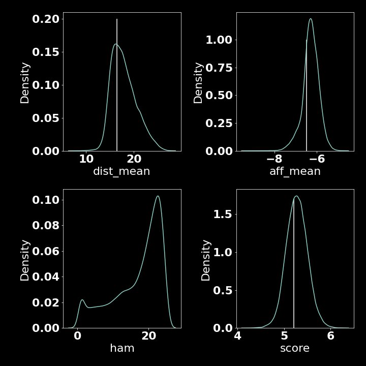
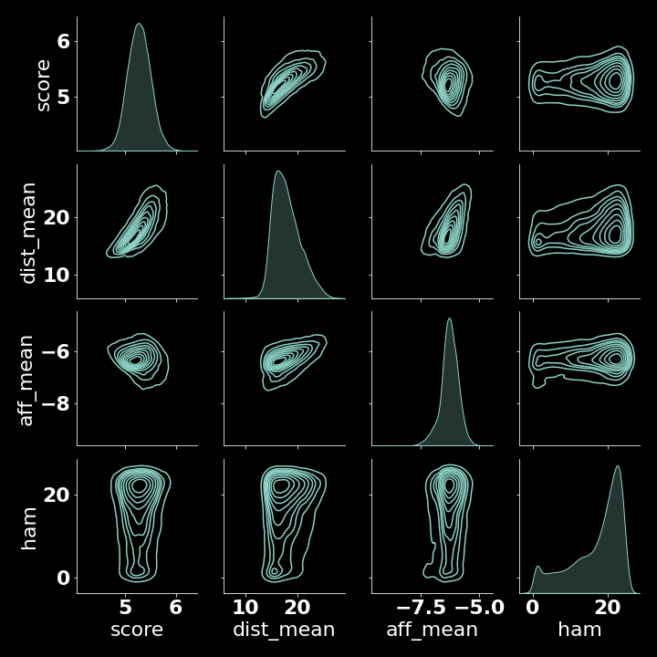
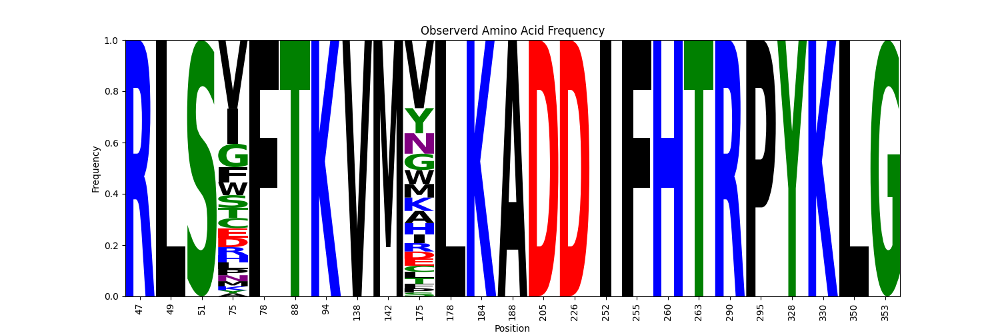

# Results 

## Contents
-------------
## Overview
This section shows results and analysis of data generated by a virtual directed evolution experiment used to re-engineer the substrate specificity of the Cytochrome P450 BM3.

## `enz` Accuracy
!!! todo
	- `enz` benchmark on BM3 structures

## Virtual Directed Evolution
!!! todo
	- link repo, make open
	- how many mutants?
	- what hardware & how long?

### Overview

`evo/evo/evo.py` is a python program designed to generate a selection of BM3 mutants with improved binding activity towards mesotrione.
`evo/evo/evo.py` uses a genetic algorithm for sequence optimization and the fitness of the generated mutants is determined by scoring docking poses of mesotrione to template-based predicted structures.

In each iteration, structures for each mutant were predicted using `enz` - a protein structure prediction and docking utility written for this work which uses a template-based implementation of sidechain repacking from `pyrosetta` and *Autodock VINA* to dock ligands to a user-specified site in the target structure. `enz` also provides data structures for protein and ligand structures, which allows fully autonomous virtual directed evolution.

The genetic algorithm created for this work (`ga`) has the following functions:

- Random amino acid substitution for a string from a uniform distribution 
- Random crossover of two strings at a randomly selected cut-point, yeilding a single string. Analagous to sex.
- Evaluation of a fitness function over a pool of mutants in parralel using multiprocessing.

Genetic algorithms were chosen because of their simplicity, ease of implementation and inherent scalability their parralel nature.

After evaluation the *fitness* of each mutant in a pool, a subset of the fittest are mated together randomly via crossover and an additional single point mutation to repopulate the pool.

Throught each virtual directed evolution experiment, the predicted mutant structures and their docked ligand poses and corresponding binding affinity data are saved to enable later analysis.

Additionally, if enough computational resource is available, several instances of the algorithm can be run in parralel and the results pooled for later analysis.

### Pseudocode
```python
def fitness_function(mutant):
	...
	# predict structure
	# dock ligand & score
	return fitness_score

template_sequence = 'AABBBAABABA'

POOL_SIZE = int

# create initial pool of mutants from template sequence
mutant_pool = [mutate(template_sequence) for _ in range(POOL_SIZE)]

for each iteration:
	fitnesses = map(fitness_function, mutant_pool) # can be parallelized
	best_mutants = ... # best scoring subset of mutant_pool
	mutant_pool = [mutate(crossover(randomly_select_2(best_mutants))) for _ iin range(POOL_SIZE)]
# after some iterations, mutant_pool should yeild high scoring mutants.
```

### Specific To This Experiment
In this experiment, the mutant pool was initalized as a set of $n$ mutants with a single point mutation relative to the A82F/F87V BM3 sequence - a mutant with expanded substrate specificity relative to the wild-type. (ref)

Starting from the A82F/F87V BM3 sequence and the template structure `4KEY.pdb`, the structure of mutants is predicted and the ligand docked and scored via `enz` - a protein structure prediction and docking utility written for this work.

The "fitness" of each mutant was calculated by:

$$
	f(mutant) = \frac{log(1 + ham)}{10} + \frac{1}{n poses} \sum distance, \frac{log(|affinity|)}{10}
$$

where :

- $mutant$ refers to the predicted structure of a mutant docked with mesotrione 
- $ham$ refers to the Hamming distance between that mutant and the template 
- $distance$ refers to the distance in Angstroms between the heme iron of the BM3 mutant and the target carbon of mesotrione in a given docking pose 
- $affinity$ is the affinity predicted by *Autodock VINA* for a given docking pose (kcal/mol)
- $n poses$ is the number of docked mesotrione poses  output by *Autodock VINA*


`evo/evo/evo.sh` manages several concurrent runs of `evo.py` using `gnu_parallel`

Since the predicted structure of each mutant and the corresponding docked poses of mesotrione are saved, 

A total of $133,944$ mutants were generated and screened for target activity on `hardware` over the course of `time`(weeks).

---
!!! todo
	-  figure labels/references

### Description of Mutants Screened
:warning: Over several attempts, the score function was tweaked.

Of the $133,944$ mutants screened, $854$ had activity more favourable than the BM3 A82F/F87V template. 

**Figure 1 A** shows kernel density estimation (KDE) plots for scoring metrics gathered over the course of the experiment and where applicable, a vertical line represents the metric value for the template protein (A82F/F87V).
In all metrics, there are several mutants that exceed the performance of the template.

**Figure 1 B** shows pairwise KDE plots of the same metrics in order to show any potential correlations.
Both `dist_mean` and `aff_mean` appear to correlate with the score function, which is expected since the score is a function of both those terms.
`dist_mean` and `aff_mean` correlate with each other, likely because they are co-optimised via the score function.
`ham` - the Hamming distance between a mutant and the template does not appear to correlate with any metric.

**Figure 1C** shows a T-stochastic neighbor embedding (TSNE) plot of the mutants evaluated across all runs, color-mapped to each metric. 
TSNE projections were derived from `bio_embeddings` `Word2VecEmbedder` created from the set of amino acids subject to change over these experiments.
The TSNE projection does not clearly show a region of sequence space that corresponds to a favourable (low) score, likely a result of the highly non-linear relationship between sequence and function.

!!! warning
	- update

<figure markdown> 
{ width="300" align=left}
{ width="300" align=left label=a}
{ width="300" align=left}
  <figcaption>Figure 1: Summary statistics of the virtual directed evolution experiment. 
  A: Kernel density estimation (KDE) plots of the metrics alone 
  B: A pairwise KDE plot showing possible correlations between the fitness score, the mean distance from the mesotrione target carbon and the heme iron (dist_mean) for all poses in a run, 
  the mean affinity for mesotrione for all poses in a run (kcl/mol)
  and the hamming distance from the template (A82F/F87V) and the mutant.
  C: a TSNE projection of the sequences tested, color-mapped to each metric.
  </figcaption>
</figure>

### Hamming Distance Issues
The data gathered here contains several mutants predicted to have favourable binding activity towards mesotrione, however the large Hamming distances with respect to the A82F/F87V template prohibit their construction via site-directed mutagenesis.
Due to constraints of this work, the maximum desired Hamming distance from an existing template is 4 - the number of seperate mutations that can be acommodated by the Agilent QuickChange Multi Mutagenesis Kit. **ref**

Despite constraints on the Hamming distance of mutants via the fitness function in `evo.py`, the algorithm favoured mutants with a large hamming distance relative to the template sequence.
This may be a result of a insufficient constraints in the fitness function, or it may be that few mutants close to the template are predicted to bind mesotrione favourably.

### Ok Mutants in the Set
!!! todo
	check set for ok ones 

### No Re-Runs
Additional time constraints prohibited re-running a tweaked version of the program. 
Therefore the existing virtual data was analyzed further to find mutant candidates with a lower Hamming distance to the template.

--- 
## Analysis
Despite the genetic algorithm used here not yeilding "fit" mutants within 4 mutations of the template, 
insights extracted from the data can be used to identify contributions of particular residues to favourable scores.
The information can narrow the search space enough to virtually screen a small subest of mutants and progress them to production and testing *in vitro*.

The aim of the analysis is to identify a small subset of mutations that contribtue to improved binding towards mesotrione which can then be simulated using `enz` before production.

### Mutation Convergence 
<figure markdown> 
{ width="600" align=left}
{ width="600" align=left}
  <figcaption>Figure 2: 
  </figcaption>
</figure>


!!! warning 
	sequence logo & heatmap seem wrong -- am i using the right dataset?
	looks like there are only 2 mutations here, must be somewhere else
	indexing issue? in dataset sequences start KEM (sequences from structures)

### Contact Analysis
### Machine Learning
#### Sequence-based
#### Structre-based
#### Generators
## Mutant Design
### Degenerate Codon Design
### Site Directed Mutagenesis Design
## Lab Results
### Binding
### Turnover
### Product Formation
