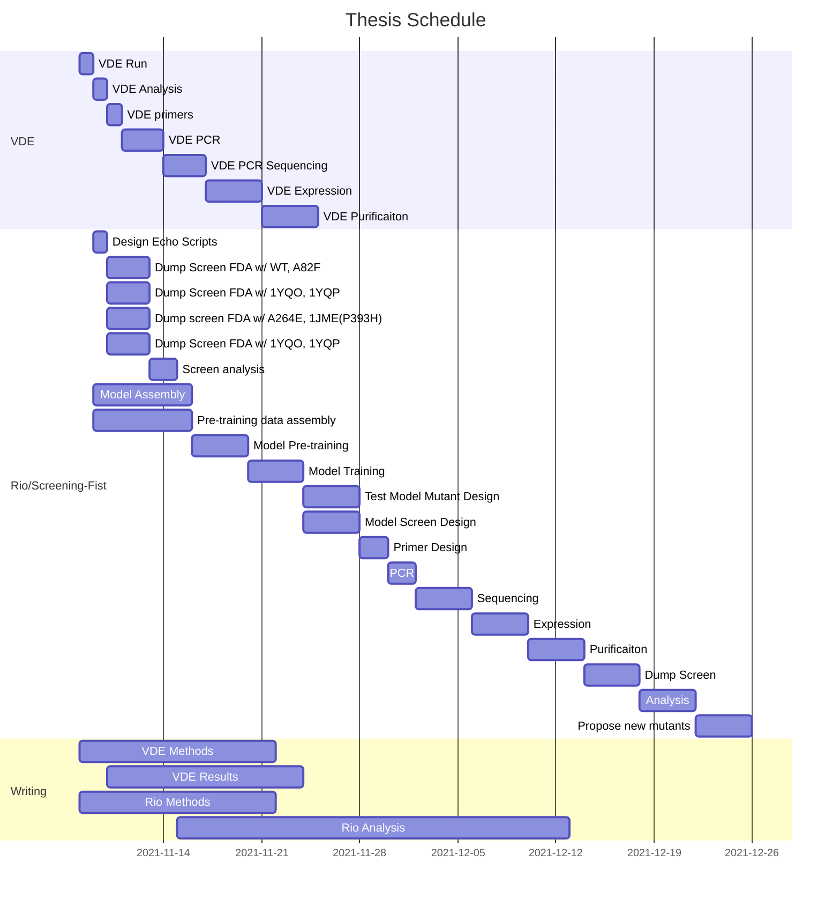

# To Do

## Overview
To do lists and schedules

## Gantt Chart 

## Tasks
- **Model:** 
	- :warning: **Rotation:**
	- **Training:** 
	- [ ] **hyperopt:**
		- [x]  **Sweep** `cuda:0 | cuda:1`
			- [ ] script should save the data as it goes
		- [ ] choose parameter set
			- `lr`: `1e-5` (small)
			- `batch_size`: `128` (large)
			- :warning: recycles don't seem important
			- downsamples 4 (few)
			- `epochs` - more(?)
		- [ ] **Regression** - best params
		- [ ] **Train & Validate**
			- [ ] Dataset - update
			- [ ] Dataset - validate CA mapping
			- [ ] Dataset - embeddings
			- [ ] Dataset - **Rotation** :warning:
			- [ ] Dataset - validation set
	- [ ] **Rotation:**

---
### VDE
- [ ] Check heme is in set
- [ ] Check on DM run
- [ ] Factor DM mutations into nn dataset
- [ ] rotation augmentations
